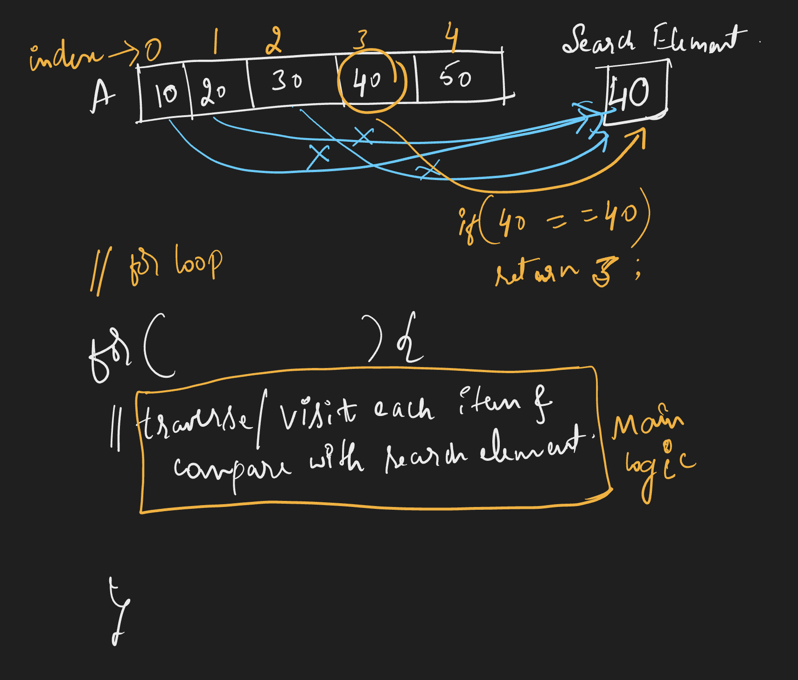

# Requirement or Problem statement & (Thought Process) Solution Approach

## 1. Problem statement

- Write a function to search element in an array and return index of that, if element is not present return -1

## 2. Features / Use cases

## 3. Understand the problem with sample inputs & outputs

### Sample - 1

- Input: [5, 3, 2, 4, 1], 2
- Output: 2

### Sample - 2

- Input: [6, 10, 12, 20, 30], 100
- Output: -1

## 4. Approach

  
<b>Approach - 1 (Brute force)</b>

- Thought Process / Approach - one pass solution

  - Use for loop to traverse the array
  - Loop each element (traverse / visit each element) & compare with search element
  - if found return that index, or else return -1

    

- Complexity
  - Time Complexity: O(n)
  - Space Complexity: O(1)

## 5. Implementation

- [Coding solution in JS](./index.js)
