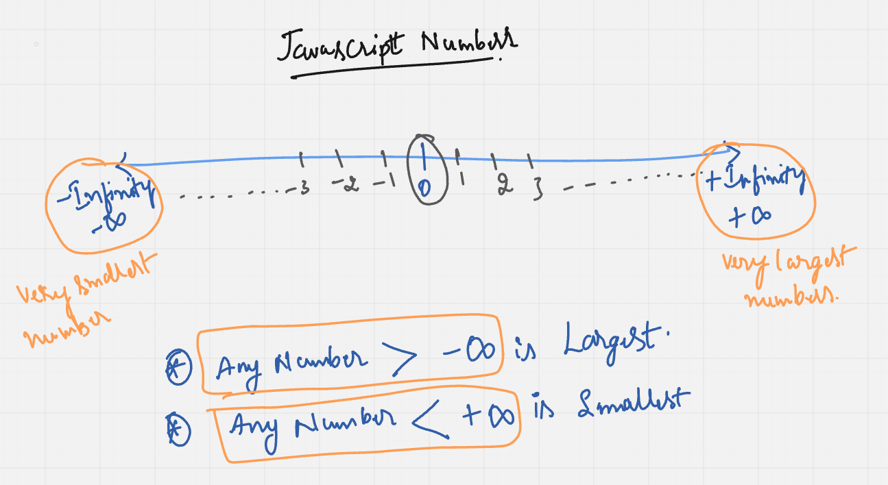
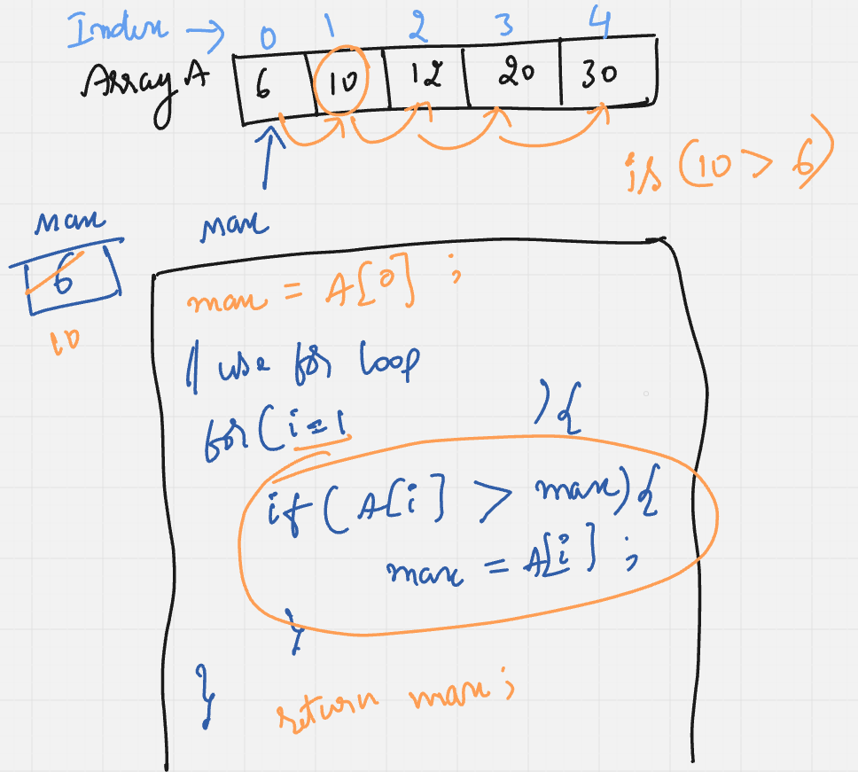
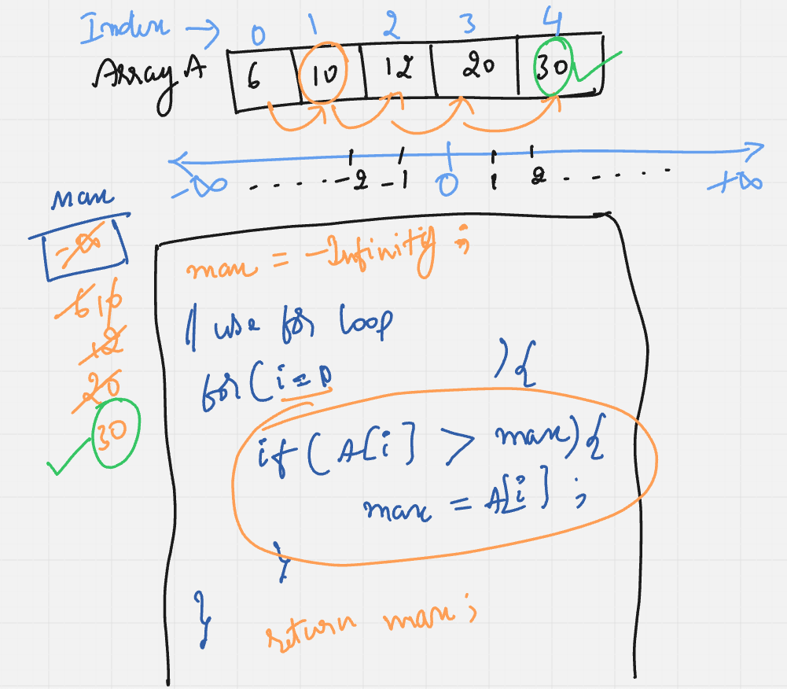

# Requirement or Problem statement & (Thought Process) Solution Approach

## 1. Problem statement

- Write a function to find Largest / Max element number in an Array

## 2. Features / Use cases

## 3. Understand the problem with sample inputs & outputs

### Sample - 1

- Input: [50, 30, -2, -40, -1, 100]
- Output: 100

### Sample - 2

- Input: [6, 10, 12, 20, 30]
- Output: 30

## 4. Approach

  
<b>Approach - 1 (Brute force)</b>

- Thought Process / Approach - one pass solution

  - Assume / assign First element as Largest variable
  - Use for loop to traverse the array elements
  - Loop each element (traverse / visit each element) & compare with Largest variable condition checks & update Largest variable
  - return Largest variable value

  
  

- Dry run with sample examples

- Complexity
  - Time Complexity: O(n)
  - Space Complexity: O(1)

  
<b>Approach - 2 (Brute force with JS -Infinity)</b>

- Thought Process / Approach - one pass solution

  - Assume / assign Largest value as -Infinity (which is very least / very smallest number in Javascript)
  - Use for loop to traverse the array elements
  - Loop each element (traverse / visit each element) & compare with Largest value condition checks & update Largest variable
  - return Largest variable value

  

- Dry run with sample examples

- Complexity
  - Time Complexity: O(n)
  - Space Complexity: O(1)

## 5. Implementation

- [Coding solution in JS](./index.js)
