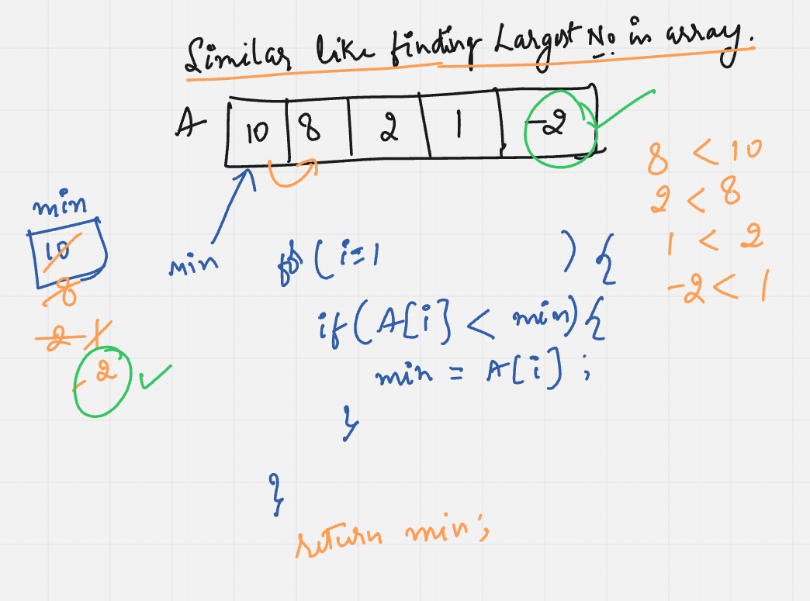
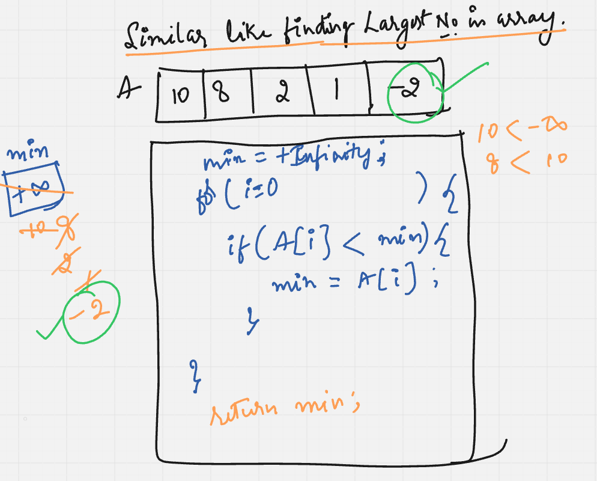

# Requirement or Problem statement & (Thought Process) Solution Approach

## 1. Problem statement

- Write a function to find Smallest / Min element number in an Array

## 2. Features / Use cases

## 3. Understand the problem with sample inputs & outputs

### Sample - 1

- Input: [50, 30, -2, -40, -1, 100]
- Output: -1

### Sample - 2

- Input: [6, 10, 12, 20, 30, 0]
- Output: 0

## 4. Approach

  
<b>Approach - 1 (Brute force)</b>

- Thought Process / Approach - one pass solution

  - Assume / assign First element as Smallest variable value
  - Use for loop to traverse the array elements
  - Loop each element (traverse / visit each element) & compare with Smallest variable condition checks & update Smallest variable
  - return Smallest variable value

  

- Dry run with sample examples

- Complexity
  - Time Complexity: O(n)
  - Space Complexity: O(1)

  
<b>Approach - 2 (Brute force with JS Infinity)</b>

- Thought Process / Approach - one pass solution

  - Assume / assign Smallest value as Infinity (which is very largest number in Javascript)
  - Use for loop to traverse the array elements
  - Loop each element (traverse / visit each element) & compare with Smallest value condition checks & update Smallest variable
  - return Smallest variable value

  

- Dry run with sample examples

- Complexity
  - Time Complexity: O(n)
  - Space Complexity: O(1)

## 5. Implementation & Refactor

- [Coding solution in JS](./index.js)

## 6. (Good to ask) Edge / Corner case covered with refactor / improvements

- What if, instead of array type if pass as other objects ?
  - Check whether its array or not, should return error message
- What if, array is empty ?
  - Should return error message
- What if, contains duplicate elements ?
