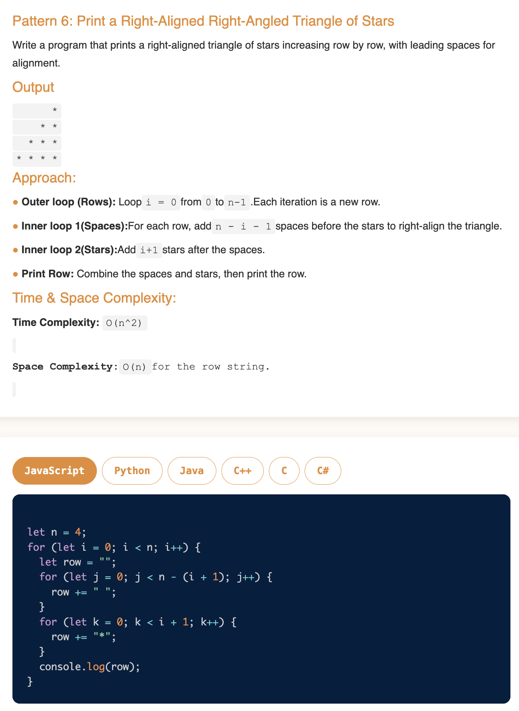

# Requirement or Problem statement & (Thought Process) Solution Approach

## 1. Problem statement

- Write a function to Print Right-Aligned Right-Angled Triangle of Stars, take n as input parameter
- Reference
  - https://pravn27.github.io/ds-algo-tech-doc/docs/ds-algo-course-tutorials/namaste-dsa/readerDoc/warm-up/star-pattern#star-pattern---6

## 2. Understand the problem with sample inputs & outputs

### Sample - 1

- Input: n = 4
- Output:

      O O O *
      O O * *
      O * * *
      * * * *

### Sample - 2

- Input: n = 3
- Output:

      O O *
      O * *
      * * *

## 3. Approach & solution notes

  
<b>Approach - 1</b>

- Thought Process / Approach

  - Think as 2D matrix with
    - i (how many rows required)
    - j (how many columns required)
  - 3 loops required - rows as i, under columns as j, k
  - Outer loop, row as i, to loop till n
  - define append variable to hold spaces, stars like O O \* ...etc
    - appendRow = "";
  - 2 Inner loop will take (j, k)
    - j loop for hold spaces " O ", will run till (n-(i+1)) times
      - appendRow = appendRow + " O ";
    - k loop for hold stars " \* ", will run till (i+1) times
      - appendRow = appendRow + " \* ";
  - Print appendRow

- Make sure dry run with sample examples with notebooks

- Complexity

  - Time Complexity: O(n2), since its nested loops with 2 loops i, j
  - Space Complexity: O(1)

  
<b>Solution Notes</b>

- 

## 4. Implementation & Refactor

- [Coding solution in JS](./index.js)

## 5. (Good to ask) Edge / Corner case covered with refactor / improvements

- What if, n is <= 0
  - Should throw error, with proper message
