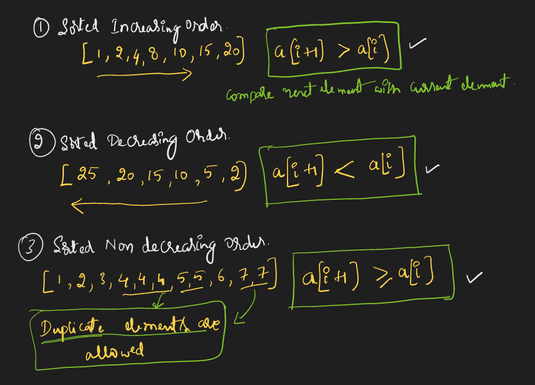
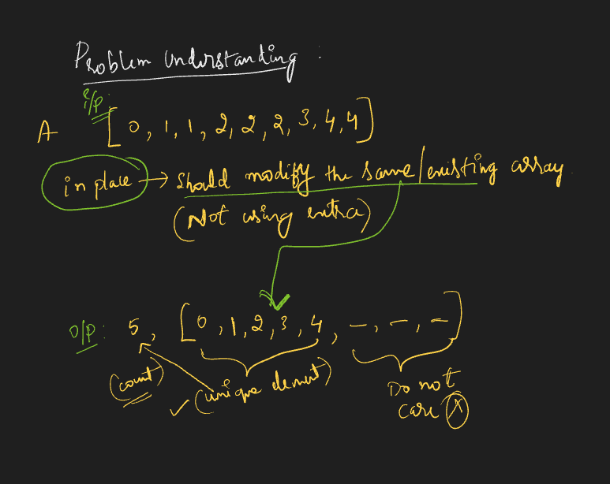

# Requirement or Problem statement & (Thought Process) Solution Approach

## 1. Problem statement

- Remove Duplicates from Sorted Array
- https://leetcode.com/problems/remove-duplicates-from-sorted-array/
- Learn to use in-place techniques to eliminate duplicates from a sorted array, returning the length of the modified array.
- 

  
<b>Summary / Key Take away from problem statement</b>

  - While reading / understanding the problem, observe important key points which helps in solution approach
  - Integer can be both positive, negative number as well
  - **Sorted increasing order, Sorted decreasing order, Sorted Non decreasing order**
    - 
  - **in-place**, means should modify the existing data structure like Array, should not use extra
    - In problem statement, should modify the existing array & remove the duplicates
  - Understanding problem
    - 
    

## 2. Understand the problem with sample inputs & outputs

### Sample - 1

- Input: [1, 1, 2]
- Output: 2, [1, 2, _]

### Sample - 2

- Input: n = 34562
- Output: 5

### Sample - 3

- Input: n = -34
- Output: 2

## 3. Approach & solution notes

  
<b>Approach - 1</b>

- Thought Process / Approach

  - Divide number by 10
    - Why 10 ? All possible digits 0, 1, ..... 9 will occur, means 0 to 9 will get total count as 10
  - define count variable
  - use while loop, will run till getting less than or equal to 0
    - num = Math.floor(num / 10)
    - count++
  - after exiting loop, return / print count

- 

- Make sure dry run with sample examples with notebooks
- Use javascript Math methods

  - Check & explore - Math.floor(), Math.ceil(), Math.round(), Math.abs()

- Complexity

  - Time Complexity: O(d), where d is number of digits
  - Space Complexity: O(1)

  
<b>Solution Notes</b>

- 
- 

## 4. Implementation & Refactor

- [Coding solution in JS](./index.js)

## 5. (Good to ask) Edge / Corner case covered with refactor / improvements

- What if, n is 0, should return 1
- What if, n is negative number, should return only digit count
