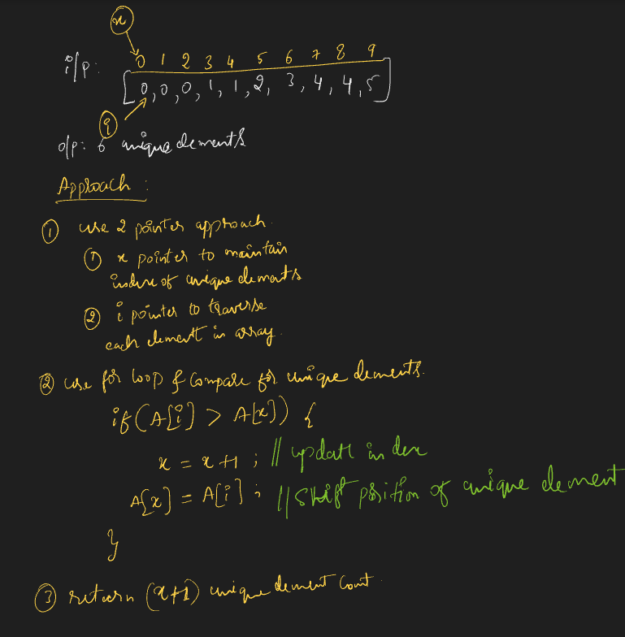
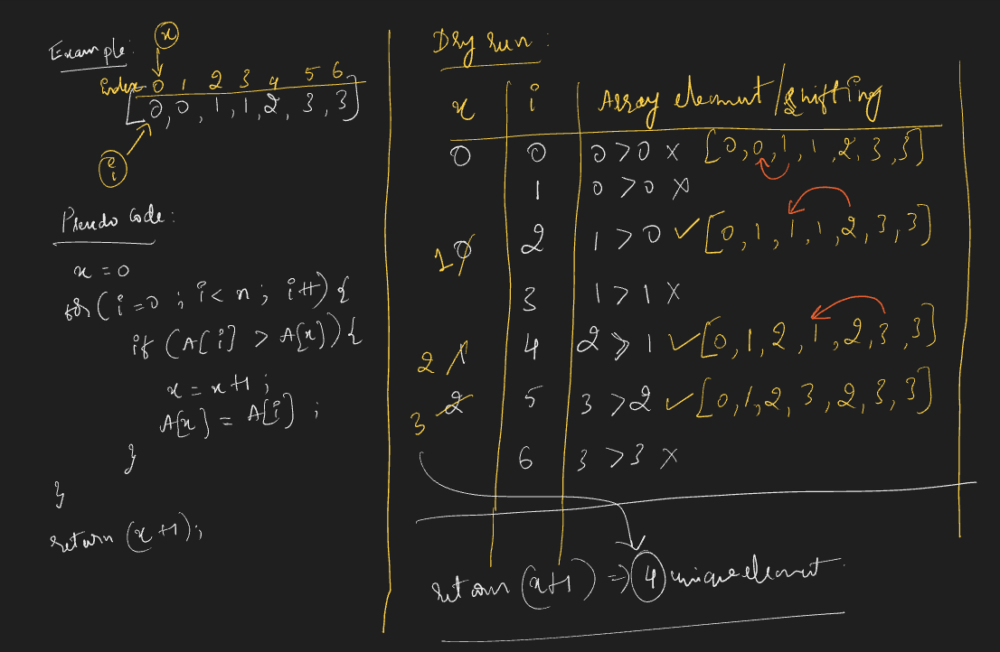
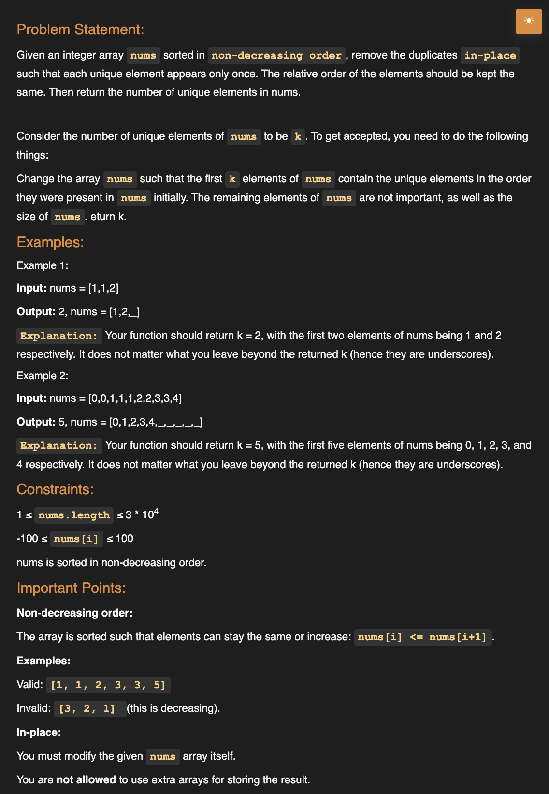
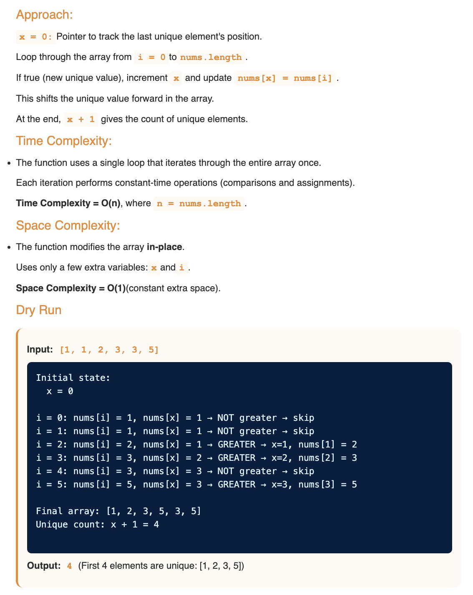
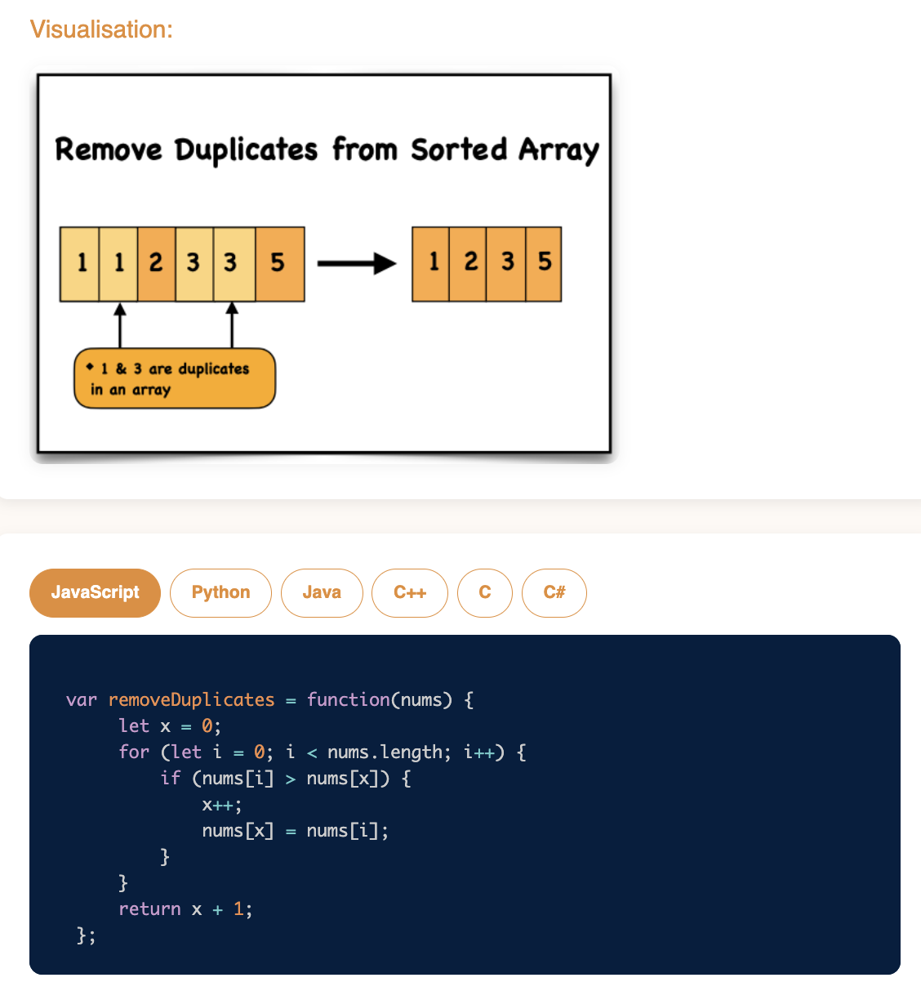

# Requirement or Problem statement & (Thought Process) Solution Approach

## 1. Problem statement

- Remove Duplicates from Sorted Array
- https://leetcode.com/problems/remove-duplicates-from-sorted-array/
- Learn to use in-place techniques to eliminate duplicates from a sorted array, returning the length of the modified array.
- 

  
<b>Summary / Take away from problem statement / Key Observation</b>

  - While reading / understanding the problem, observe important key points which helps in solution approach
  - Integer can be both positive, negative number as well
  - **Sorted increasing order, Sorted decreasing order, Sorted Non decreasing order**
    - 
  - **in-place**, means should modify the existing data structure like Array, should not use extra
    - In problem statement, should modify the existing array & remove the duplicates
  - Understanding problem
    - 
    

## 2. Understand the problem with sample inputs & outputs

### Sample - 1

- Input: [1, 1, 2]
- Output: 2
- In place / Modified existing array [1, 2, _]

### Sample - 2

- Input: [0, 1, 1, 1, 2, 2]
- Output: 3
- In place / Modified existing array [0, 1, 2, _, _, _]

## 3. Approach & solution notes

  
<b>Approach - 1</b>

- Thought Process / Approach

  - use 2 pointer approach x, i
    - x pointer to maintain index of unique elements placement
    - i pointer to traverse / visit each elements in the array
  - use for loop to traverse each element, use i pointer
    - inside for loop, compare to find unique element & change / shift the position of unique element by updating x, array elements
  - outside of loop, return (x + 1) are unique elements count

- 
- 

- Make sure dry run with sample examples with notebooks

- Complexity

  - Time Complexity: O(n), where n is length of the array
  - Space Complexity: O(1)

  
<b>Solution Notes</b>

- 
- 
- 

## 4. Implementation & Refactor

- [Coding solution in JS](./index.js)

## 5. (Good to ask) Edge / Corner case covered with refactor / improvements

- What if, instead of array type if pass as other objects ?
  - Check whether its array or not, should return error message
- What if array is empty ?
  - Should return error message
