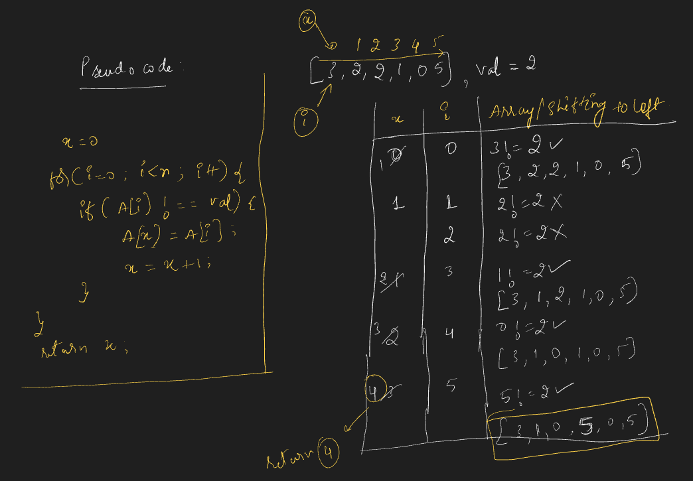

# Requirement or Problem statement & (Thought Process) Solution Approach

## 1. Problem statement

- Remove Element
- https://leetcode.com/problems/remove-element/description/
- Learn to remove elements matching a target value from an array using in-place operations and minimal extra space.
- 

  
<b>Summary / Take away from problem statement / Key Observation</b>

  - While reading / understanding the problem, observe important key points which helps in solution approach
  - Integer can be both positive, negative number as well
  - **in-place**, means should modify the existing data structure like Array, should not use extra
  - Understanding problem
    - 
    

## 2. Understand the problem with sample inputs & outputs

### Sample - 1

- Input: nums = [3, 2, 2, 3], val = 3
- Output: 2
- In place / Modified existing array nums [2, 2, _, _]

### Sample - 2

- Input: nums = [0, 1, 2, 2, 3, 0, 4, 2], val = 2
- Output: 5
- In place / Modified existing array nums [0, 1, 3, 0, 4, _, _, _]

## 3. Approach & solution notes

  
<b>Approach - 1</b>

- Thought Process / Approach

  - use 2 pointer approach x, i
    - x pointer to count array elements which not equals to val and keep index of shifting element to left
    - i pointer to traverse / visit each elements in the array
  - use for loop to traverse each element, use i pointer
    - inside for loop, condition compare to element not equal to val
      - update / shift element to x pointer index
      - update x pointer, increment counting by 1
  - outside of loop, return x

- 
- 

- Make sure dry run with sample examples with notebooks

- Complexity

  - Time Complexity: O(n), where n is length of the array
  - Space Complexity: O(1)

  
<b>Solution Notes</b>

- 
- 
- 

## 4. Implementation & Refactor

- [Coding solution in JS](./index.js)

## 5. (Good to ask) Edge / Corner case covered with refactor / improvements
