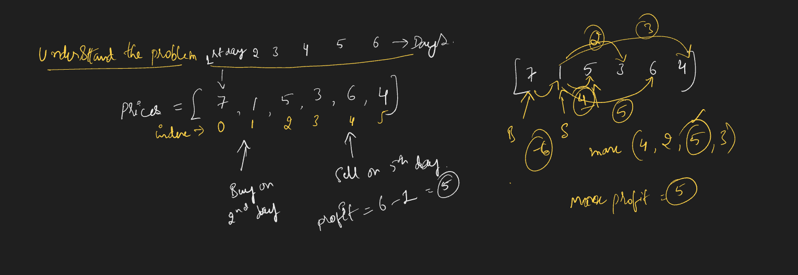
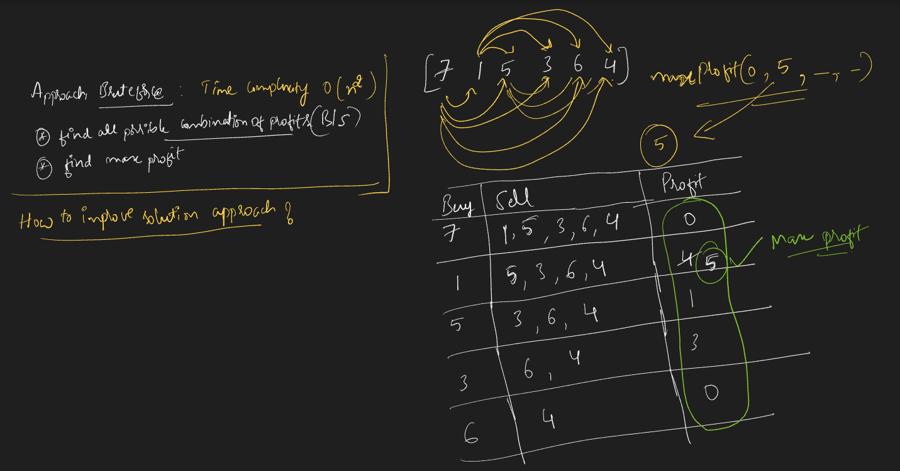
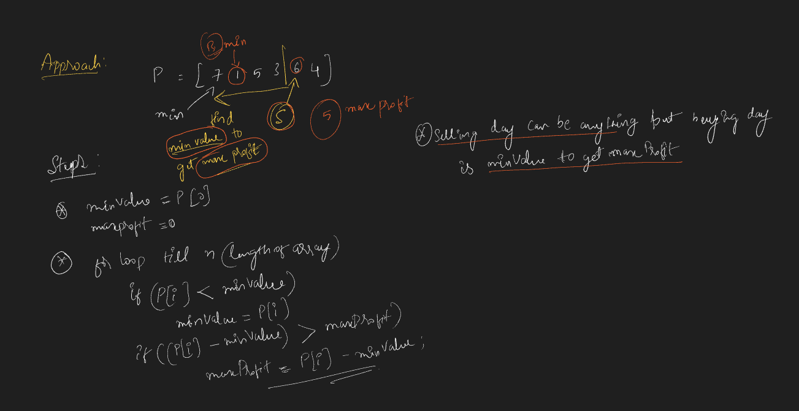
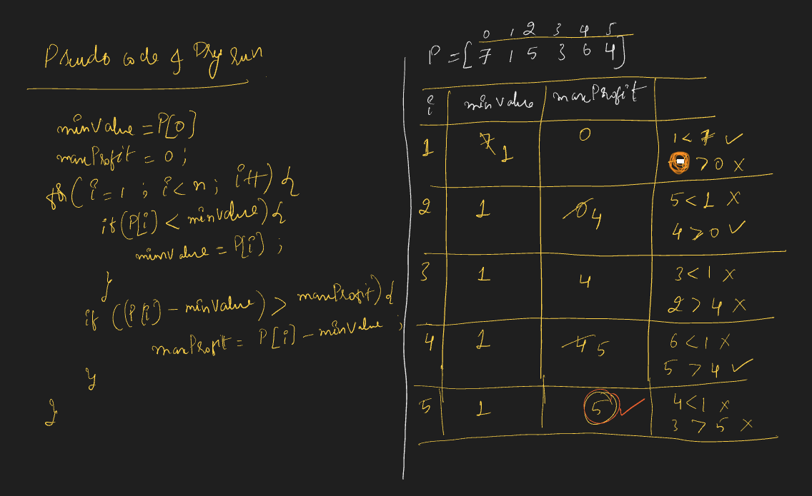
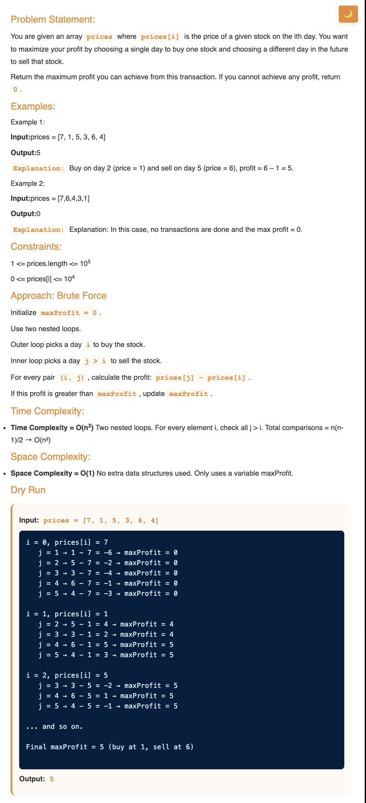
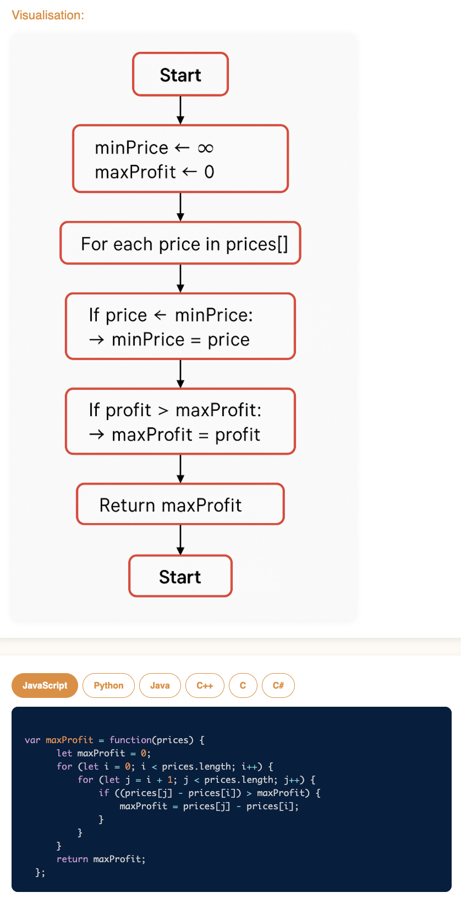
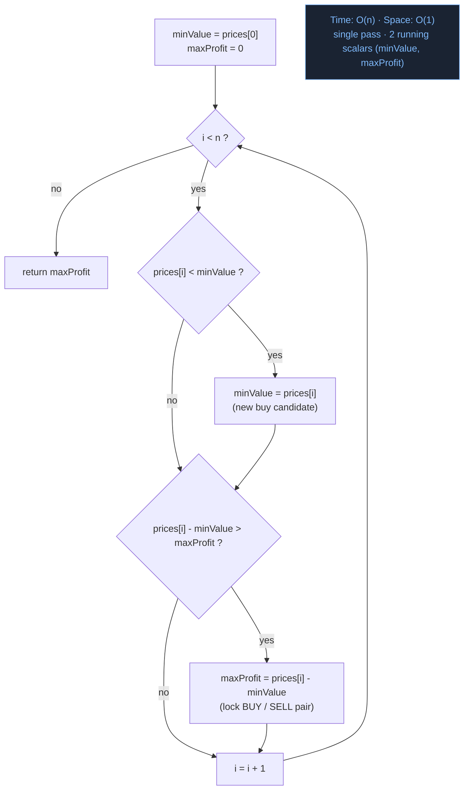

# Requirement or Problem statement & (Thought Process) Solution Approach

## 1. Problem statement

- Best Time to Buy and Sell Stock
- https://leetcode.com/problems/best-time-to-buy-and-sell-stock/description/
- Learn to find the best day to buy and sell stocks to maximize profit. This greedy algorithm teaches dynamic decision-making for optimal stock trading.
- <details>

  <summary><b>Summary / Take away from problem statement / Key Observation</b></summary>

  - You can not able to Buy & Sell on same day / initial day
  - Understand the problem

    - 

    </details>

## 2. Understand the problem with sample inputs & outputs

### Sample - 1

- Input: prices = [2, 3, 1, 6, 9, 10]
- Output: 9

### Sample - 2

- Input: prices = [1, 2, 5, 4, 3]
- Output: 4

## 3. Approach & solution notes

<details>
  <summary><b>Approach - 1</b></summary>

- Thought Process / Approach

  - **Brute force approach**

    - 

  - **Improved approach, time complexity O(n)**
    - use for loop, traverse each item in Price Array
      - (Find Smallest element in price array) if you want to sell specific day, find minValue / smallest element before that by compare
      - (Compare max profit with (P[i] - minValue) & update max profit) find max profit by compare
        - if((P[i]-minValue) > maxProfit)
            - maxProfit = P[i]-minValue
    - return max profit

- 
- 

- Make sure dry run with sample examples with notebooks

- Complexity

  - Time Complexity: O(n), where n is length of the array
  - Space Complexity: O(1)

</details>

<details>
  <summary><b>Solution Notes</b></summary>

- 
- 

</details>

## 3.1 Visual flow (spaced repetition)

**Interactive walkthrough — with Play · Prev / Next · presets · step duration:**

- [Open on GitHub Pages](https://pravn27.github.io/ds-algo-coding-challenge/namaste-dsa/easy/array/04/visual-flow.html) — live, public, works on any device
- [Open local file](./visual-flow.html) — for IDE / offline use

**Mnemonic:** Walk left → right · track lowest-so-far (`minValue`, the best buy candidate) · at each day compute `prices[i] − minValue` and keep the **max** · **never buy in the future, never sell in the past**.

```text
[ past days |  i (today, scan)  | future days ]
              ▲ orange
              ▼
             min ▲ cyan  (running minimum — best buy candidate)

   when maxProfit updates → lock the pair: BUY day (green tint) → SELL day (violet tint)
```


```mermaid
flowchart TD
  S["minValue = prices[0]<br>maxProfit = 0"] --> L{"i &lt; n ?"}
  L -->|no| R["return maxProfit"]
  L -->|yes| A{"prices[i] &lt; minValue ?"}
  A -->|yes| UM["minValue = prices[i]<br>(new buy candidate)"]
  A -->|no| B{"prices[i] - minValue &gt; maxProfit ?"}
  UM --> B
  B -->|yes| UP["maxProfit = prices[i] - minValue<br>(lock BUY / SELL pair)"]
  B -->|no| N["i = i + 1"]
  UP --> N
  N --> L

  CX["Time: O(n) &middot; Space: O(1)<br>single pass &middot; 2 running scalars (minValue, maxProfit)"]:::cx
  classDef cx fill:#1a2332,stroke:#7eb8ff,color:#7eb8ff
```

| Variable / marker | Role |
|--------|------|
| `i` (scanner) | Current day being evaluated, scans left → right starting at `1` |
| `minValue` | **Running minimum** of `prices[0…i]` — the best buy candidate so far |
| `maxProfit` | Best profit found so far (the answer) — only ever increases |
| BUY day / SELL day | When `maxProfit` updates, the pair locks in as `BUY = minIdx`, `SELL = i` |
| Order matters | Update `minValue` **first**, then check profit — so today can both be the new buy *and* sell candidate without issue |

### Complexity (and why greedy beats brute-force here)

| | Big-O | Why |
|---|---|---|
| **Time**  | `O(n)`  | single forward pass — each day is visited once and does **constant work** (2 comparisons) |
| **Space** | `O(1)`  | just 2 running scalars (`minValue`, `maxProfit`) plus the loop counter — no extra arrays, no recursion |

> Concrete contrast for spaced repetition:
> - Greedy `O(n)`     · `n = 1,000,000` → **1,000,000 ops** (one pass)
> - Brute force `O(n²)` · `n = 1,000,000` → **~500,000,000,000 ops** (every i × every j) — *infeasible*

> Tip: open the interactive page, hit **Play** on the *`[7, 6, 4, 3, 1]` · no profit* preset first — internalizing why `maxProfit` stays `0` for monotonically falling prices is the cleanest way to remember the greedy invariant.

## 4. Implementation & Refactor

- [Coding solution in JS](./index.js)

## 5. (Good to ask) Edge / Corner case covered with refactor / improvements

- What if, instead of array type if pass as other objects ?
  - Check whether its array or not, should return error message
- What if array is empty ?
  - Should return error message
