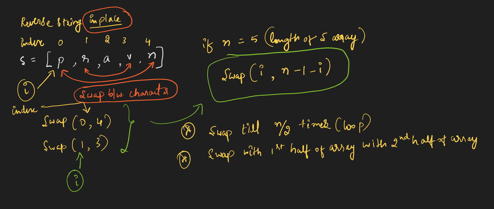
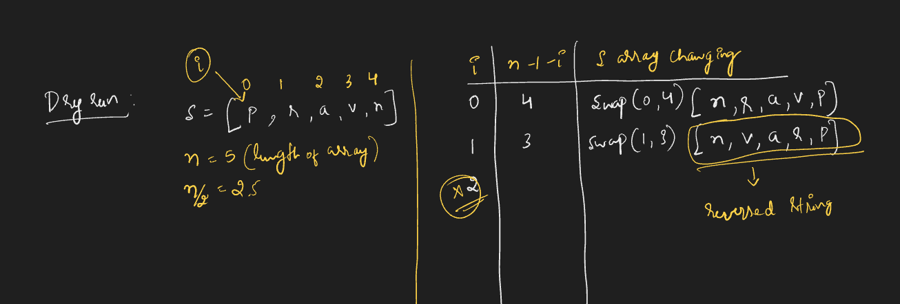
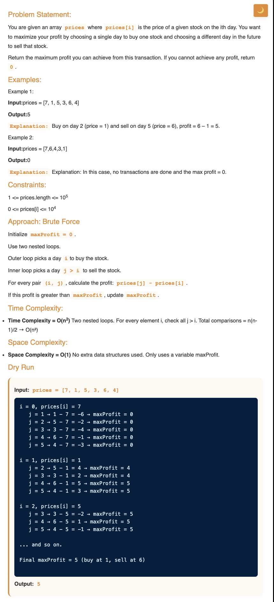
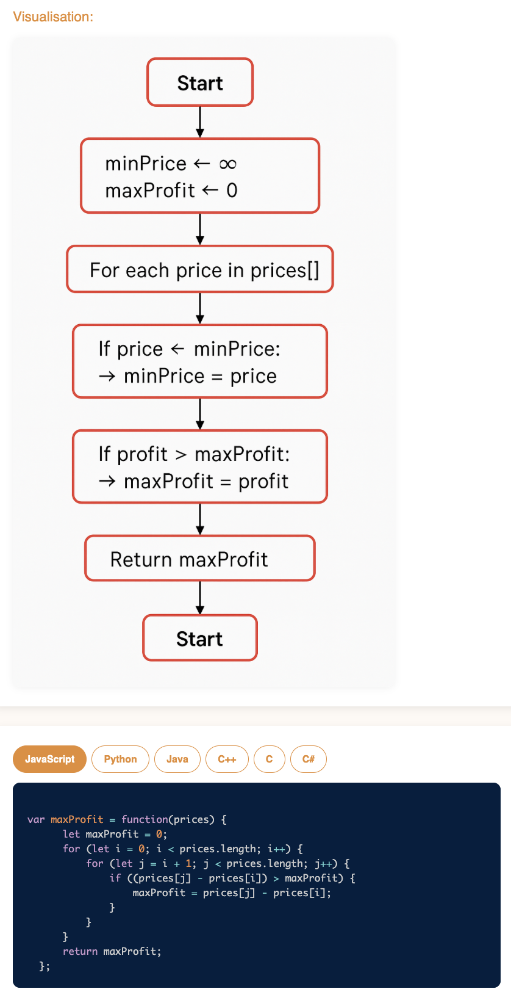

# Requirement or Problem statement & (Thought Process) Solution Approach

## 1. Problem statement

- Best Time to Buy and Sell Stock
- https://leetcode.com/problems/best-time-to-buy-and-sell-stock/description/
- Learn to find the best day to buy and sell stocks to maximize profit. This greedy algorithm teaches dynamic decision-making for optimal stock trading.
- 

  
<b>Summary / Take away from problem statement / Key Observation</b>

  - **in-place**, means should modify the existing data structure like Array, should not use extra memory space

    

## 2. Understand the problem with sample inputs & outputs

### Sample - 1

- Input: prices = [2, 3, 1, 6, 9, 10]
- Output: 9

### Sample - 2

- Input: prices = [1, 2, 5, 4, 3]
- Output: 4

## 3. Approach & solution notes

  
<b>Approach - 1</b>

- Thought Process / Approach

  - use for loop, till n/2 times
    - swap(i, n-1-i), use temp variable

- 
- 
- 

- Make sure dry run with sample examples with notebooks

- Complexity

  - Time Complexity: O(n), where n is length of the array
  - Space Complexity: O(1)

  
<b>Solution Notes</b>

- 
- 

## 4. Implementation & Refactor

- [Coding solution in JS](./index.js)

## 5. (Good to ask) Edge / Corner case covered with refactor / improvements

- What if, instead of array type if pass as other objects ?
  - Check whether its array or not, should return error message
- What if array is empty ?
  - Should return error message
