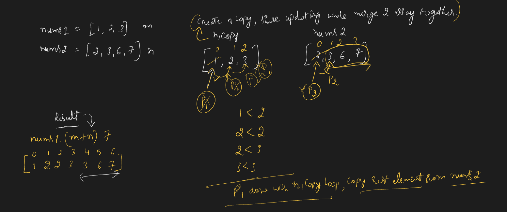
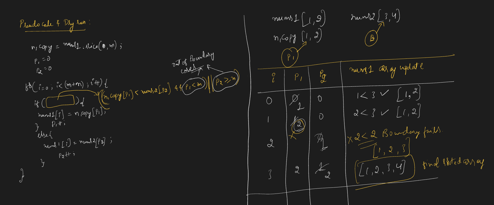
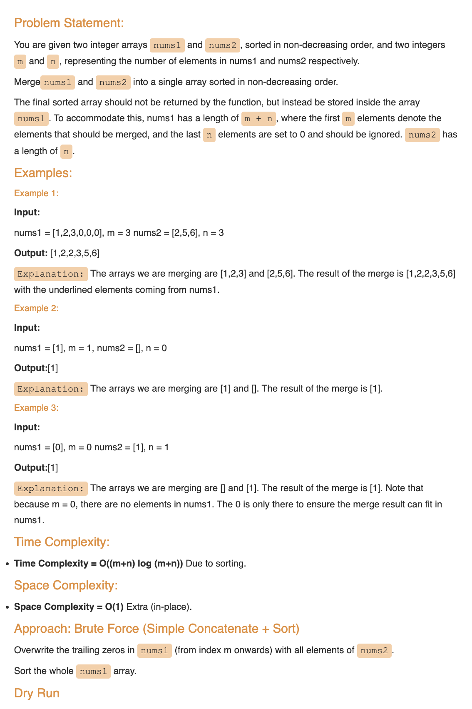
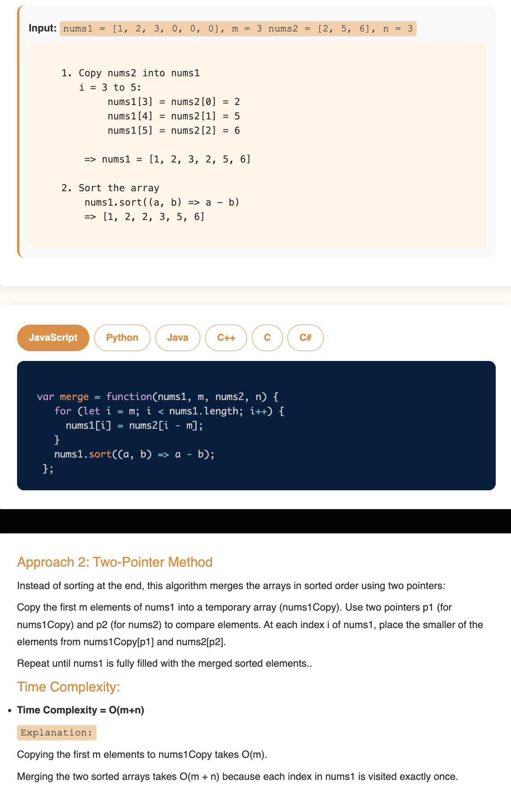
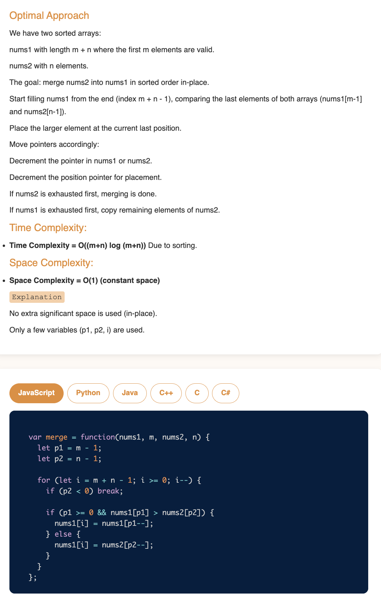

# Requirement or Problem statement & (Thought Process) Solution Approach

## 1. Problem statement

- Merge Sorted Array
- https://leetcode.com/problems/merge-sorted-array/description/
- This video explains the two-pointer technique to merge arrays efficiently. Essential for problems like merge sort and combining datasets.
- 

  
<b>Summary / Take away from problem statement / Key Observation</b>

  - Under problem

    - 

    

## 2. Understand the problem with sample inputs & outputs

### Sample - 1

- Input: nums1 = [1,2], m = 2, nums2 = [2,5,6], n = 3
- Output: [1,2,2,5,6]

### Sample - 2

- Input: nums1 = [1,2,3,4], m = 4, nums2 = [1,4,6], n = 3
- Output: [1,1,2,3,4,4,6]

## 3. Approach & solution notes

  
<b>Approach - 1 Brute force</b>

- 

  
<b>Approach - 2</b>

- Thought Process / Approach

  - **Improved approach, Time complexity O(m+n) and Space complexity O(m)**
    - create copy of nums1 array, since we update for merged sorted array
    - use 2 pointer p1, p2
      - compare for small values, fill from beginning of nums1 array
    - make sure handle array boundary case, after crossing for p1, p2

- 
- 

- Make sure dry run with sample examples with notebooks

  - 

- Complexity

  - Time Complexity: O(m+n), where m, n is length of the nums1, nums2 array
  - Space Complexity: O(m), where m is length of nums1 array, due to extra space for copied nums1 array

  
<b>Approach - 3 Best case</b>

- Thought Process / Approach

  - **Improved approach, Time complexity O(m+n) and Space complexity O(1)**
    - compare and fill in the reverse order from end
    - use 2 pointer p1, p2
      - compare for large element, fill from end of nums1 array (m+n) length
    - make sure handle array boundary case, after crossing for p1, p2

- 
- 

- Make sure dry run with sample examples with notebooks

  - 

- Complexity

  - Time Complexity: O(m+n), where m, n is length of the nums1, nums2 array
  - Space Complexity: O(1), its will be in place nums1 array

  
<b>Solution Notes</b>

- 
- 
- 
- 

## 4. Implementation & Refactor

- [Coding solution in JS](./index.js)

## 5. (Good to ask) Edge / Corner case covered with refactor / improvements

- What if, instead of array type if pass as other objects ?
  - Check whether its array or not, should return error message
- What if array is empty ?
  - Should return error message
