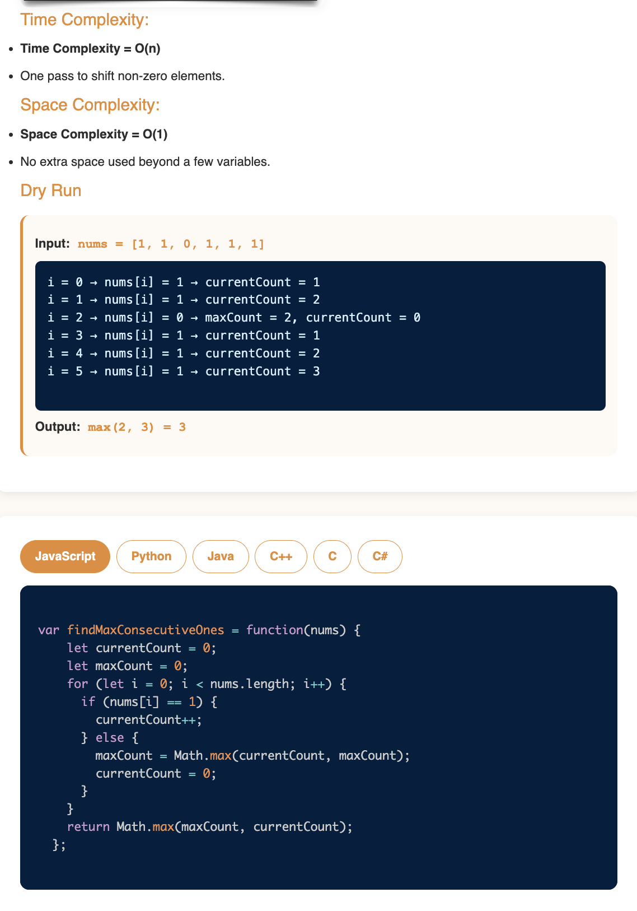

# Requirement or Problem statement & (Thought Process) Solution Approach

## 1. Problem statement

- Missing Number
- https://leetcode.com/problems/missing-number/description/
- This episode covers mathematical and XOR-based approaches to finding the missing element from an array, a common interview question.

## 2. Understand the problem with sample inputs & outputs

### Sample - 1

- Input: nums = [0,1,1,0,1,1,1,1]
- Output: 4

### Sample - 2

- Input: nums = [1,1,0,0,0,1,1]
- Output: 2

## 3. Approach & solution notes

  
<b>Approach - 1 Best case</b>

- Thought Process / Approach

  - for loop to visit each element in array
    - if each consecutive one visit / traverse, increment consOnesCount by 1
      - if(A[i] === 1) consOnesCount++;
    - else if encounter/visit zero, update maxCount compare with consOnesCount and reset consOnesCount to 0
  - return return max of maxCount or consOnesCount

- Make sure dry run with sample examples with notebooks

- Complexity

  - Time Complexity: O(n), where n is length of the array
  - Space Complexity: O(1)

  
<b>Solution Notes</b>

- 
- 

## 4. Implementation & Refactor

- [Coding solution in JS](./index.js)

## 5. (Good to ask) Edge / Corner case covered with refactor / improvements

- What if, instead of array type if pass as other objects ?
  - Check whether its array or not, should return error message
- What if array is empty ?
  - Should return error message
