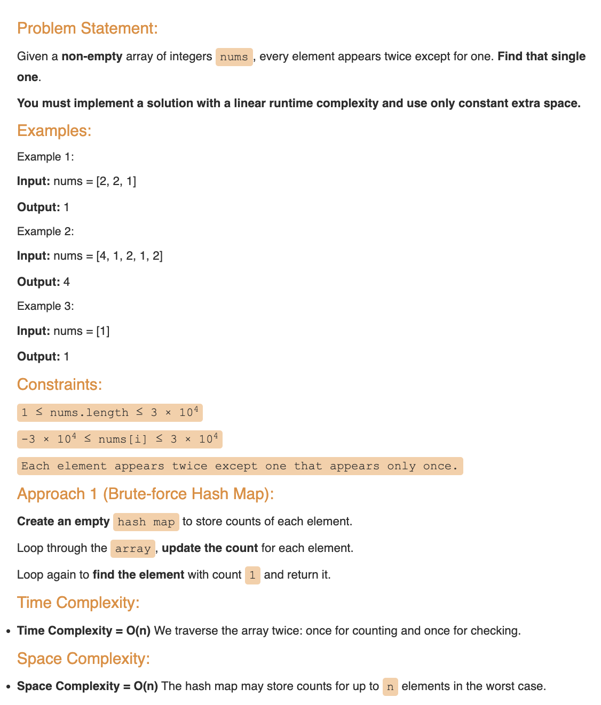
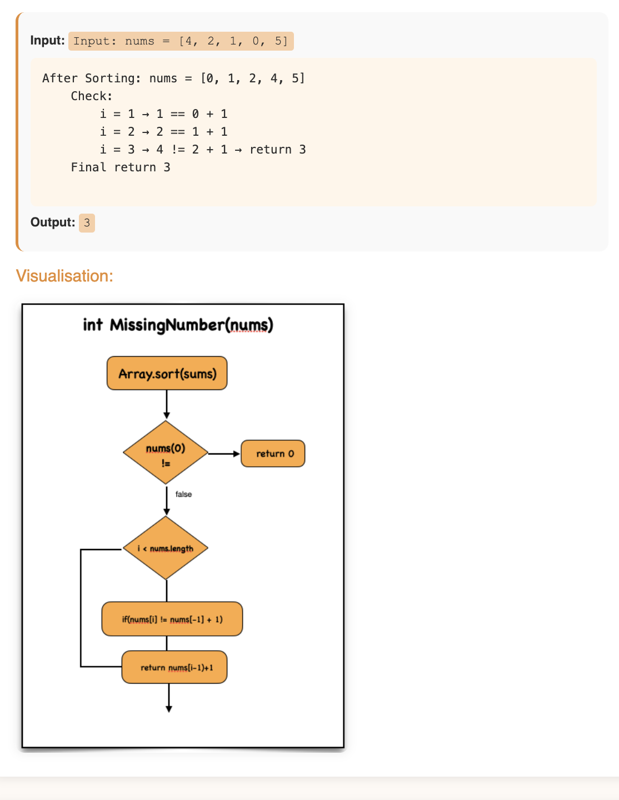
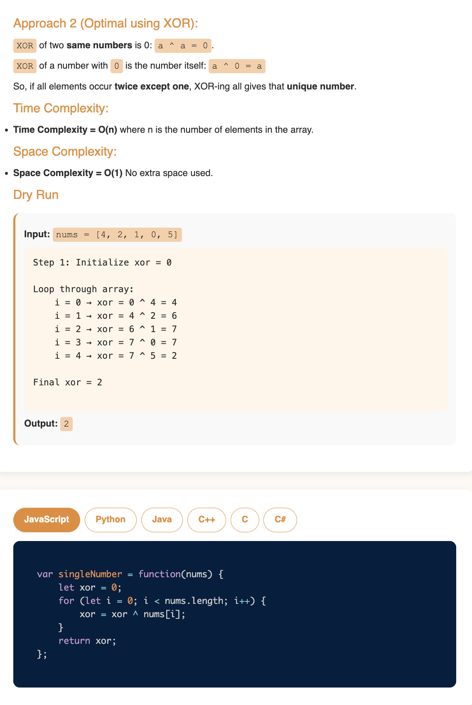
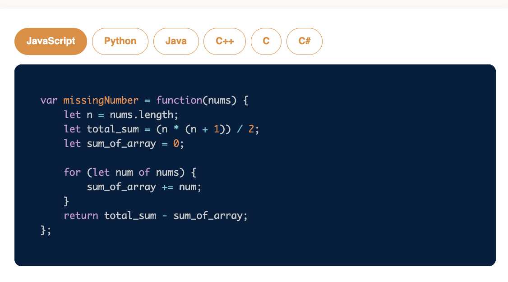

# Requirement or Problem statement & (Thought Process) Solution Approach

## 1. Problem statement

- Single Number
- https://leetcode.com/problems/single-number/
- Learn a clever approach using bitwise XOR to identify the single non-repeated element in an array. An essential pattern for DSA.

## 2. Understand the problem with sample inputs & outputs

### Sample - 1

- Input: nums = [2,2,1,1,5,4,5]
- Output: 4

### Sample - 2

- Input: nums = [1,1,5,2,5]
- Output: 2

## 3. Approach & solution notes

  
<b>Approach - 1 Brute force</b>

- Thought Process / Approach

  - use HashMap, which is Javascript Objects
  - for loop to traverse elements of array nums
    - check if element exist in Objects
      - if not, create with value 1
    - if exist, increment by value 1
  - Another for loop to check in Object which element has value 1 and return that

- Make sure dry run with sample examples with notebooks

- Complexity

  - Time Complexity: O(n), where n is length of the array
  - Space Complexity: O(n), for extra Hashmap object allocation, where n is length of the array

  
<b>Approach - 2 Best case</b>

- Thought Process / Approach

  - use XOR bitwise operation on elements of nums array

- Make sure dry run with sample examples with notebooks

- Complexity

  - Time Complexity: O(n), where n is length of the array
  - Space Complexity: O(1), No extra space used

  
<b>Solution Notes</b>

- 
- 
- 
- 

## 4. Implementation & Refactor

- [Coding solution in JS](./index.js)

## 5. (Good to ask) Edge / Corner case covered with refactor / improvements

- What if, instead of array type if pass as other objects ?
  - Check whether its array or not, should return error message
- What if array is empty ?
  - Should return error message
