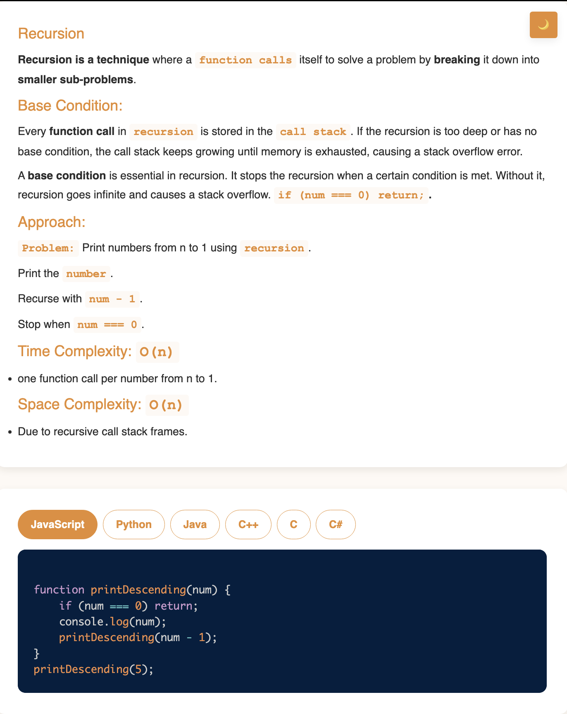

# Requirement or Problem statement & (Thought Process) Solution Approach

## 1. Problem statement

- Print n to 1 to using recursion

## 2. Understand the problem with sample inputs & outputs

### Sample - 1

- Input: n = 5
- Output: 5 4 3 2 1

### Sample - 2

- Input: n = 3
- Output: 3 2 1

## 3. Approach & solution notes

  
<b>Approach - 1</b>

- Thought Process / Approach

  - using Recursion, print number n, n-1, n-2, n-3 ........1
    - what is the base condition ?
    - what is the recursive case ?

- Make sure dry run with sample examples with notebooks

- Complexity

  - Time Complexity: O(n), where n is input
  - Space Complexity: O(n), due to call stack

  
<b>Solution Notes</b>

- 

## 4. Implementation & Refactor

- [Coding solution in JS](./index.js)

## 5. (Good to ask) Edge / Corner case covered with refactor / improvements
