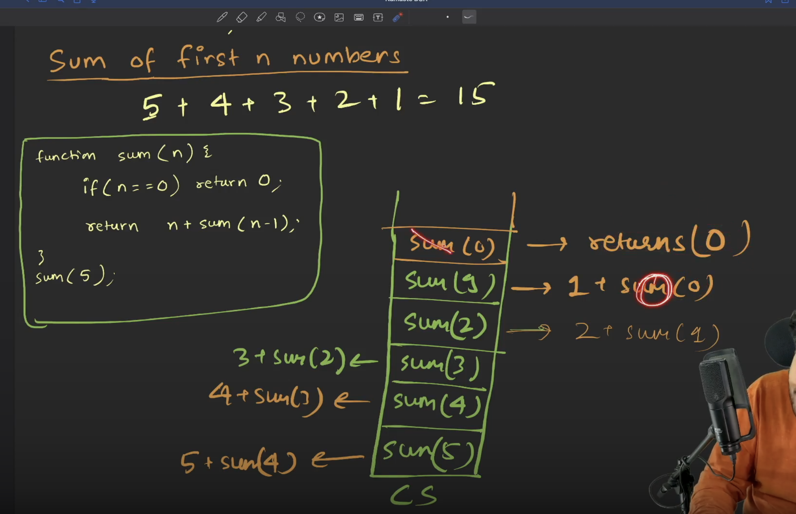
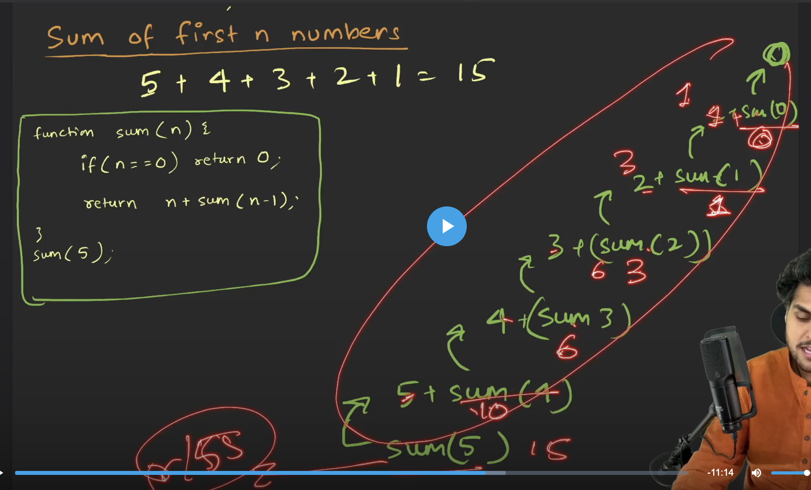
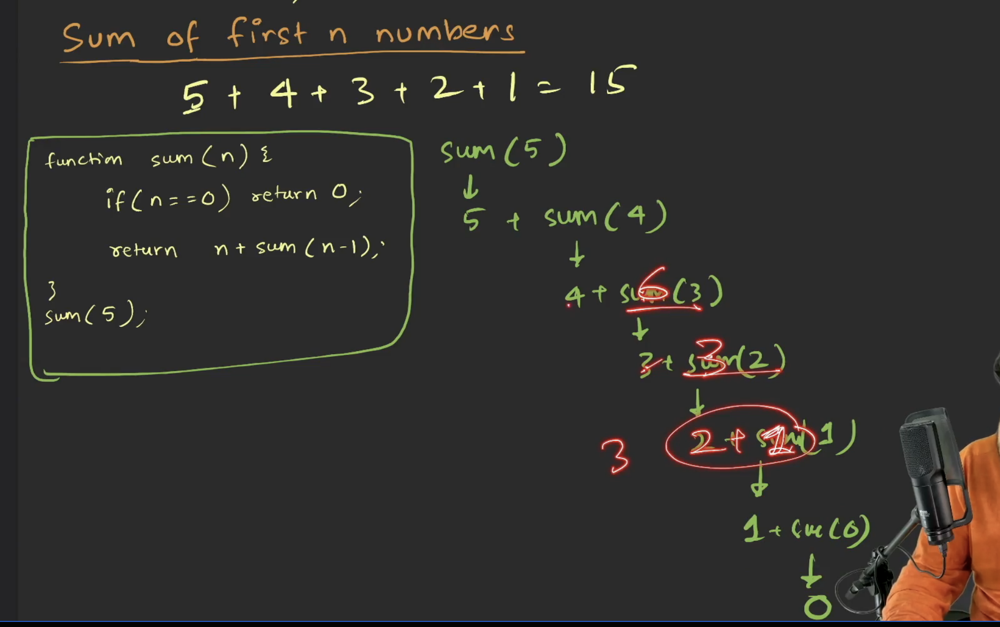
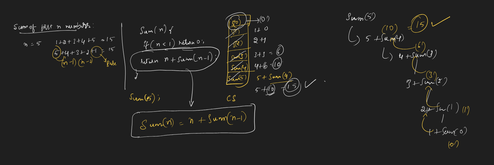
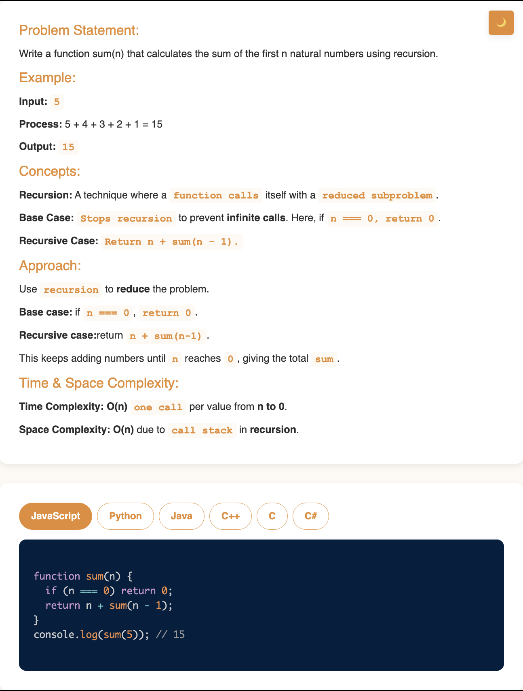

# Requirement or Problem statement & (Thought Process) Solution Approach

## 1. Problem statement

- Sum of first n numbers, starting from 1, using recursion
- This video explains how to use recursion to efficiently find the sum of the first n natural numbers, reinforcing key recursion concepts with a simple example.

## 2. Understand the problem with sample inputs & outputs

### Sample - 1

- Input: n = 5
- Output: 1 + 2 + 3 + 4 + 5 = 15

### Sample - 2

- Input: n = 3
- Output: 1 + 2 + 3 = 6

## 3. Approach & solution notes

  
<b>Approach - 1</b>

- Thought Process / Approach

  - using Recursion, n + (n-1) + (n-2) + .... + 1

    - what is the base condition ?
      - if n < 1, return 0
    - what is the recursive case ?
      - n + sum(n-1)

  - 
  - 
  - 

- Make sure dry run with sample examples with notebooks

  - 

- Complexity

  - Time Complexity: O(n), where n is input
  - Space Complexity: O(n), due to call stack

  
<b>Solution Notes</b>

- 

## 4. Implementation & Refactor

- [Coding solution in JS](./index.js)

## 5. (Good to ask) Edge / Corner case covered with refactor / improvements
