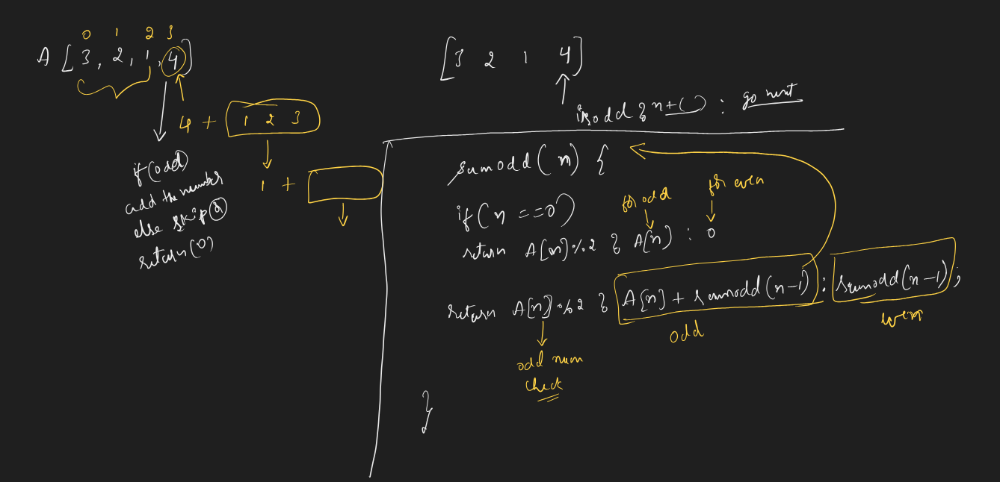
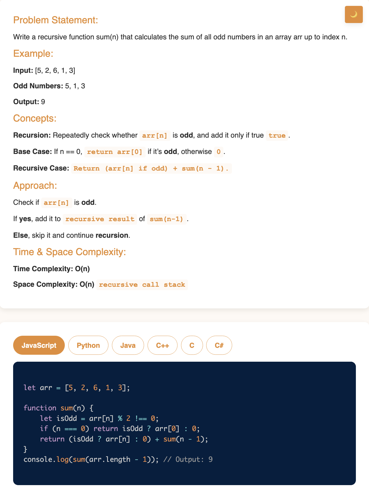

# Requirement or Problem statement & (Thought Process) Solution Approach

## 1. Problem statement

- Sum of all Odd numbers in Array, using recursion
- This video covers different approaches to compute the sum of elements in an array, from loops to recursion, enhancing your problem-solving skills.

## 2. Understand the problem with sample inputs & outputs

### Sample - 1

- Input: [3, 2, 1, 4, 5]
- Output: 9

### Sample - 2

- Input: [3, 4, 5, 2]
- Output: 8

## 3. Approach & solution notes

  
<b>Approach - 1</b>

- Thought Process / Approach

  - using Recursion

    - Odd number condition check, num % 2 != 0
    - what is the base condition ?
      - if length === 0, return isNumOdd ? arr[0] : 0
    - what is the recursive case ?
      - isNumOdd ? arr[n] + sumOdd(n-1) : sumOdd(n-1), where n is (Array.length-1) which is last element index

  - 

- Make sure dry run with sample examples with notebooks

- Complexity

  - Time Complexity: O(n), where n is input
  - Space Complexity: O(n), due to call stack

  
<b>Solution Notes</b>

- 

## 4. Implementation & Refactor

- [Coding solution in JS](./index.js)

## 5. (Good to ask) Edge / Corner case covered with refactor / improvements
