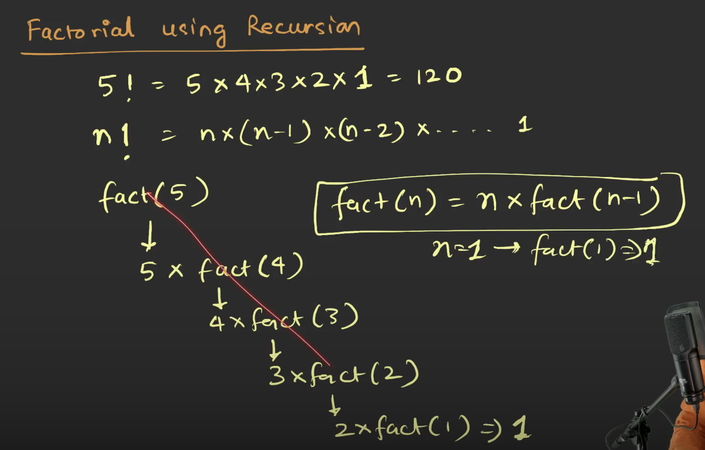
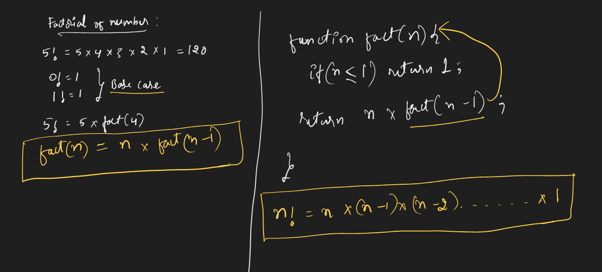
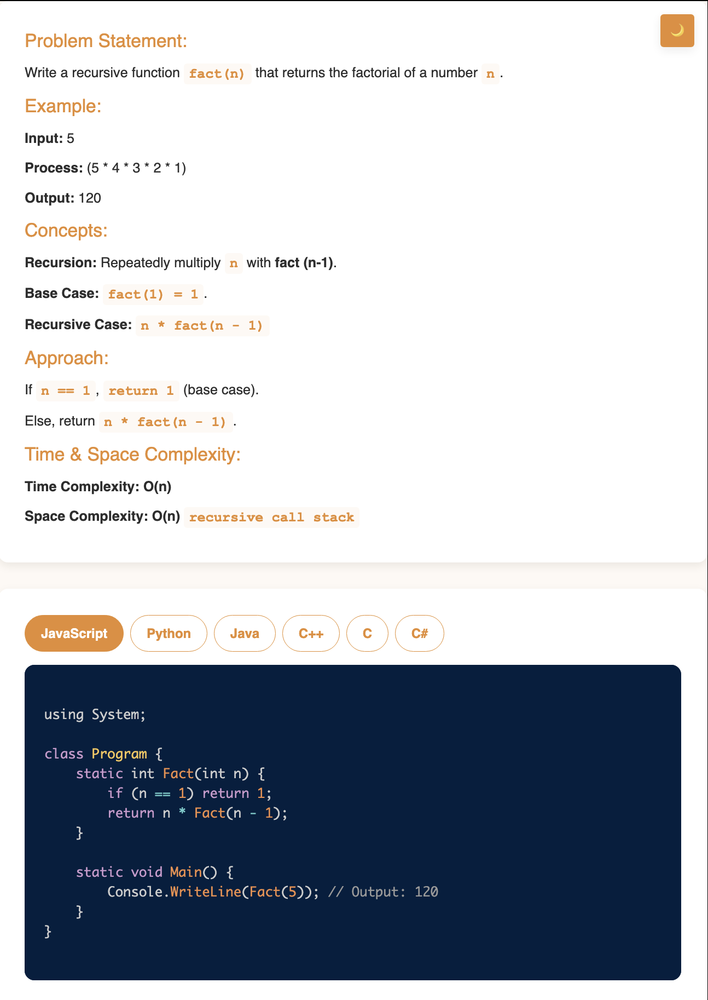

# Requirement or Problem statement & (Thought Process) Solution Approach

## 1. Problem statement

- Factorial of n, using recursion
- This video demonstrates how to use recursive logic to compute the factorial of a number, a classic example of recursion in programming.

## 2. Understand the problem with sample inputs & outputs

### Sample - 1

- Input: n = 3
- Output: 6

### Sample - 2

- Input: n = 5
- Output: 120

## 3. Approach & solution notes

  
<b>Approach - 1</b>

- Thought Process / Approach

  - using Recursion

    - what is the base condition ?
      - if n == 1 or n <= 1, return 1
    - what is the recursive case ?
      - return n \* fact(n-1)

  - 
  - 

- Make sure dry run with sample examples with notebooks

- Complexity

  - Time Complexity: O(n), where n is input
  - Space Complexity: O(n), due to call stack

  
<b>Solution Notes</b>

- 

## 4. Implementation & Refactor

- [Coding solution in JS](./index.js)

## 5. (Good to ask) Edge / Corner case covered with refactor / improvements
