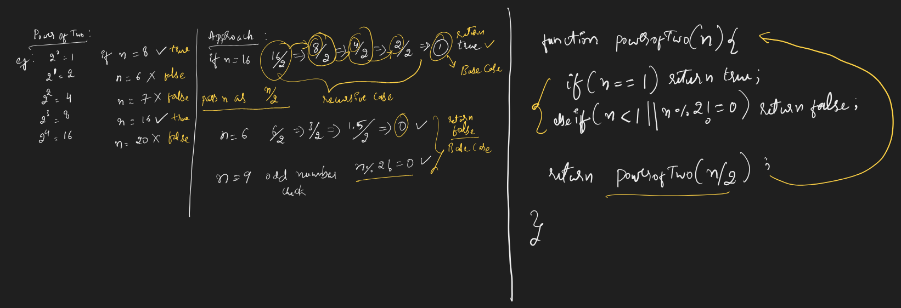
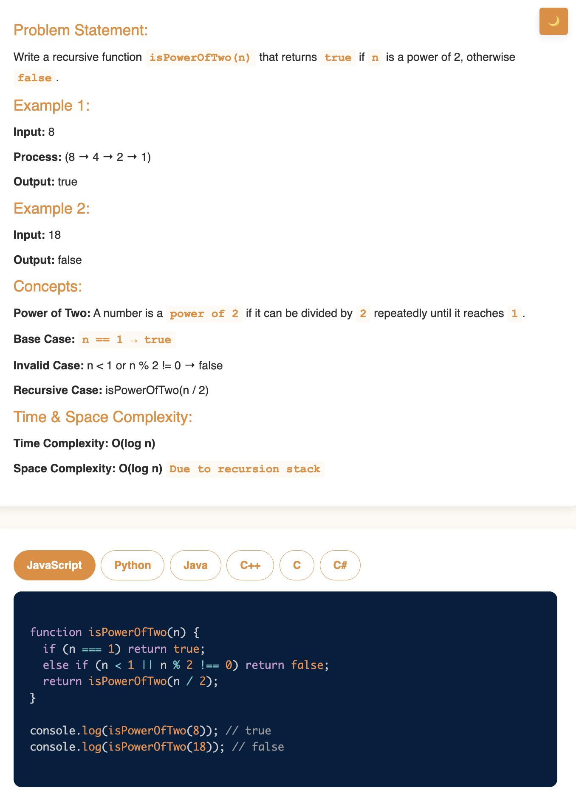

# Requirement or Problem statement & (Thought Process) Solution Approach

## 1. Problem statement

- Power of Two, using recursion
- https://leetcode.com/problems/power-of-two/description/
- This video walks you through solving the “Power of Two” problem, explaining the approach and how to implement it efficiently using recursion.

## 2. Understand the problem with sample inputs & outputs

### Sample - 1

- Input: n = 8
- Output: true

### Sample - 2

- Input: n = 16
- Output: true

### Sample - 3

- Input: n = 6
- Output: false

## 3. Approach & solution notes

  
<b>Approach - 1</b>

- Thought Process / Approach

  - using Recursion

    - Get the pattern, keep divide number n by 2, till we get 1 or less than 1
    - what is the base condition ?
      - if n == 1 return true
      - else if (n < 1 || n % 2 != 0) return false
    - what is the recursive case ?
      - return powerOfTwo(n / 2)

  - 

- Make sure dry run with sample examples with notebooks

- Complexity

  - Time Complexity: O(n), where n is input
  - Space Complexity: O(n), due to call stack

  
<b>Solution Notes</b>

- 

## 4. Implementation & Refactor

- [Coding solution in JS](./index.js)

## 5. (Good to ask) Edge / Corner case covered with refactor / improvements
