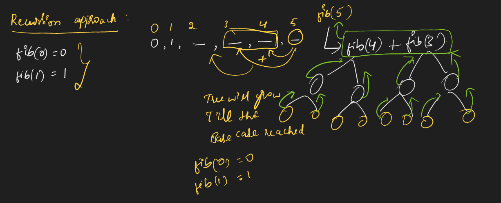
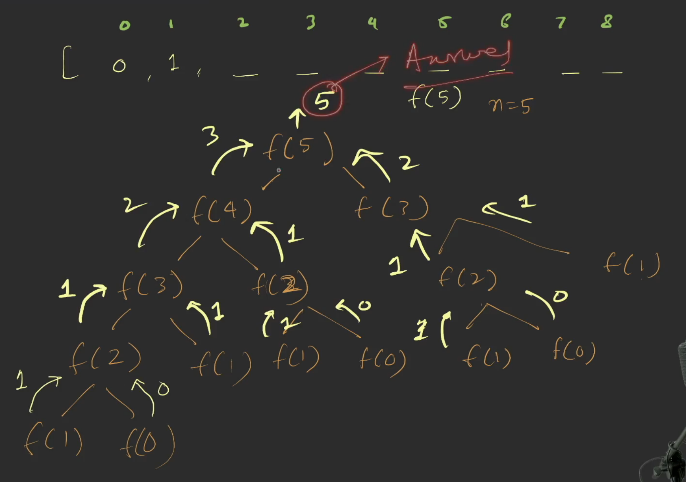
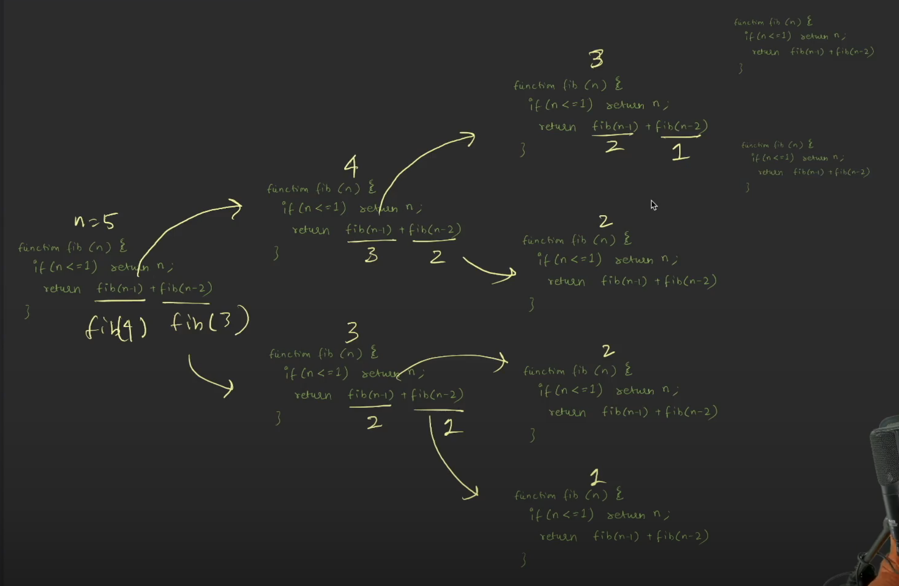
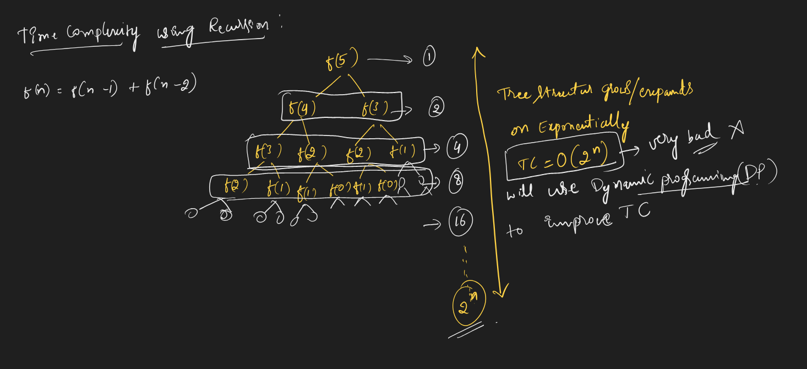
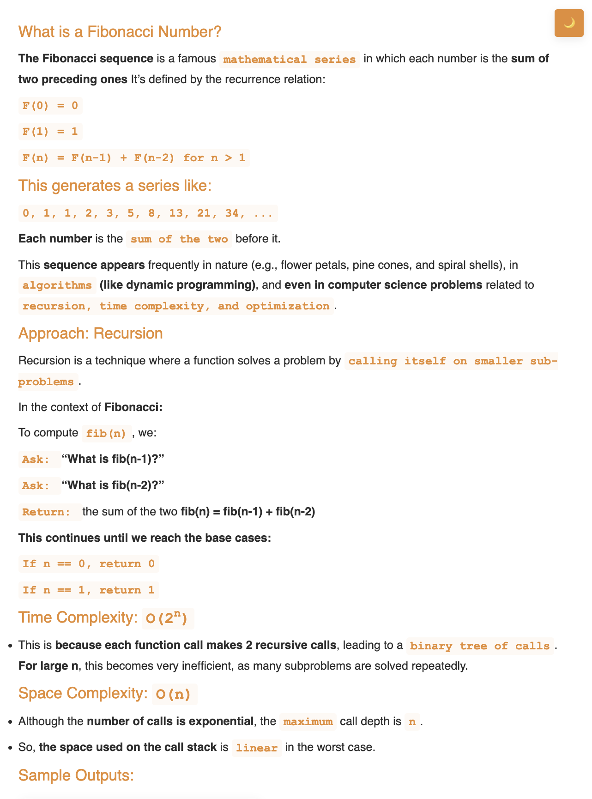
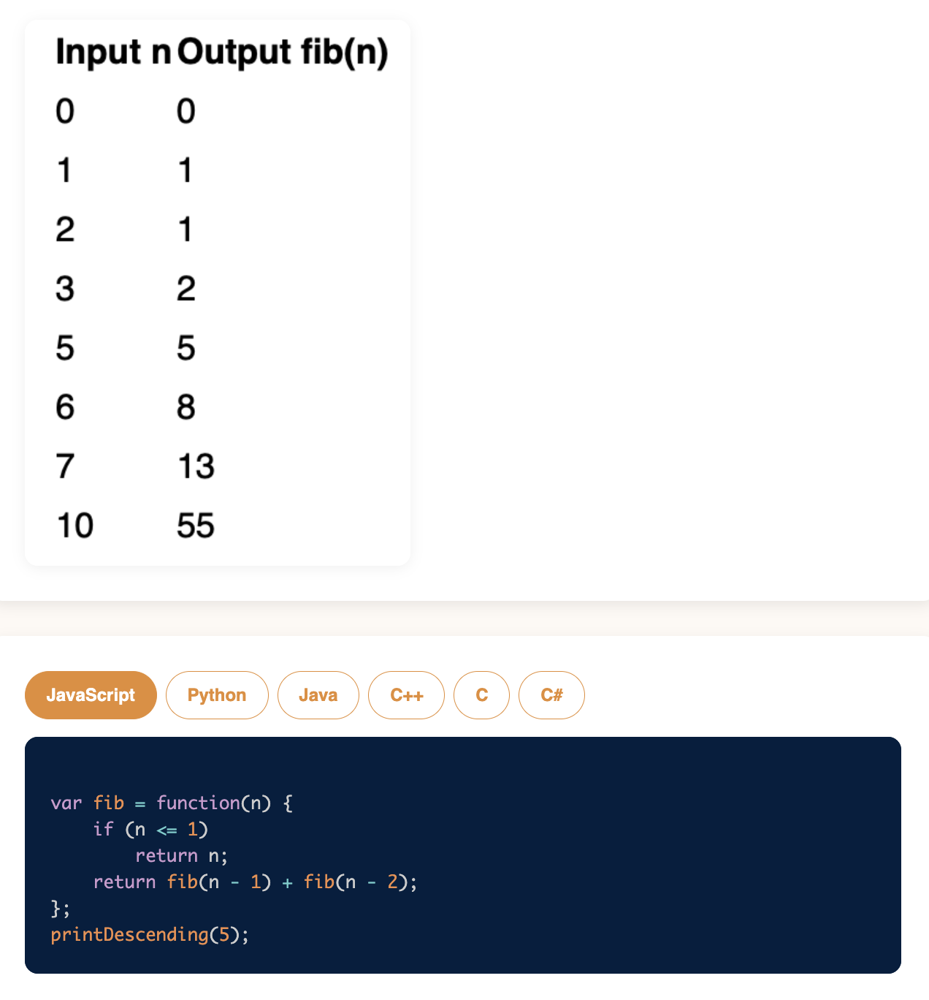

# Requirement or Problem statement & (Thought Process) Solution Approach

## 1. Problem statement

- Fibonacci number, using recursion
- https://leetcode.com/problems/fibonacci-number/description/
- This video takes your recursion knowledge to the next level by covering advanced use cases, problem-solving patterns, and optimizations. A must-watch to truly master recursion.

## 2. Understand the problem with sample inputs & outputs

### Sample - 1

- Input: n = 8
- Output: 21

### Sample - 2

- Input: n = 5
- Output: 5

### Sample - 3

- Input: n = 6
- Output: 8

## 3. Approach & solution notes

  
<b>Approach - 1</b>

- Thought Process / Approach

  - using Iterative approach

    - using for loop, works in forward thinking
    - Time & Space Complexity: O(n)
    - 

  - using Recursion approach, works in backward thinking

    - what is the base condition ?
      - if n <= 1 return n
    - Recursive case, every time when calling recursive case, making 2 branch
      - return fib(n-1) + fib(n-2)

  - 
  - 
  - 
  - 

- Make sure dry run with sample examples with notebooks

- Complexity in recursion approach

  - Time Complexity: O(2^n), since tree structure grows in exponentially where n is input, can be improved using Dynamic Programming
  - Space Complexity: O(n), due to call stack
  - 

  
<b>Solution Notes</b>

  
- 
- 

## 4. Implementation & Refactor

- [Coding solution in JS](./index.js)

## 5. (Good to ask) Edge / Corner case covered with refactor / improvements
