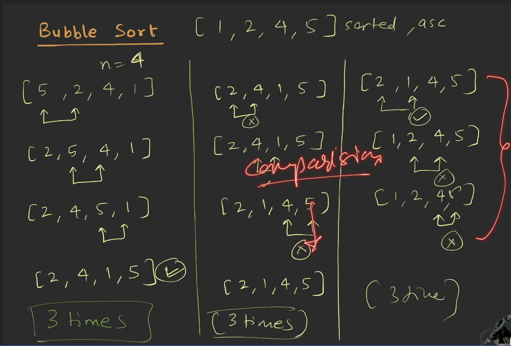
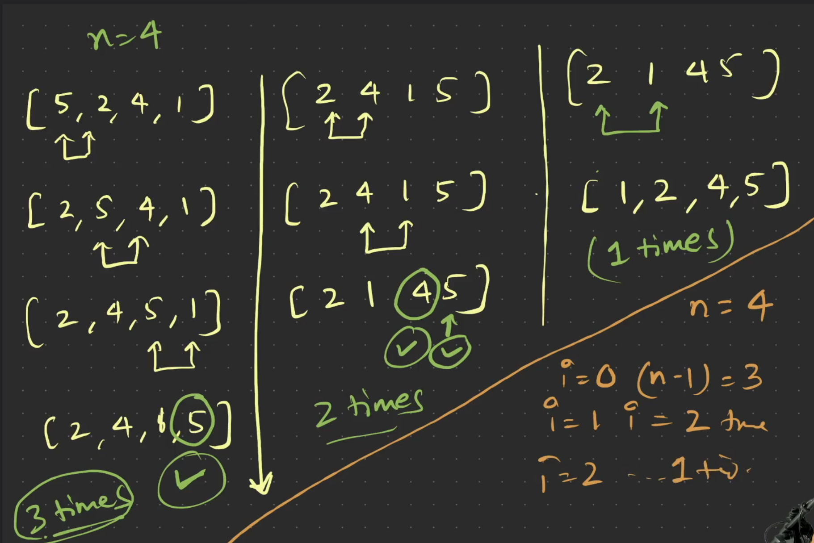
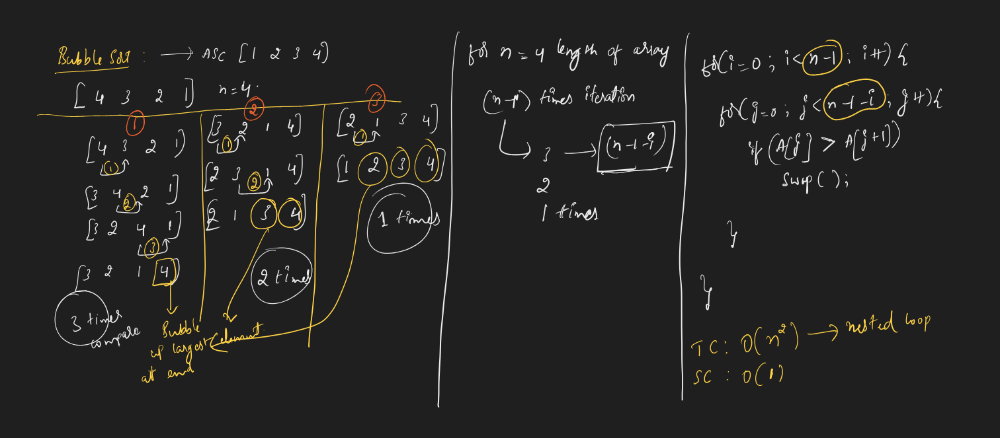
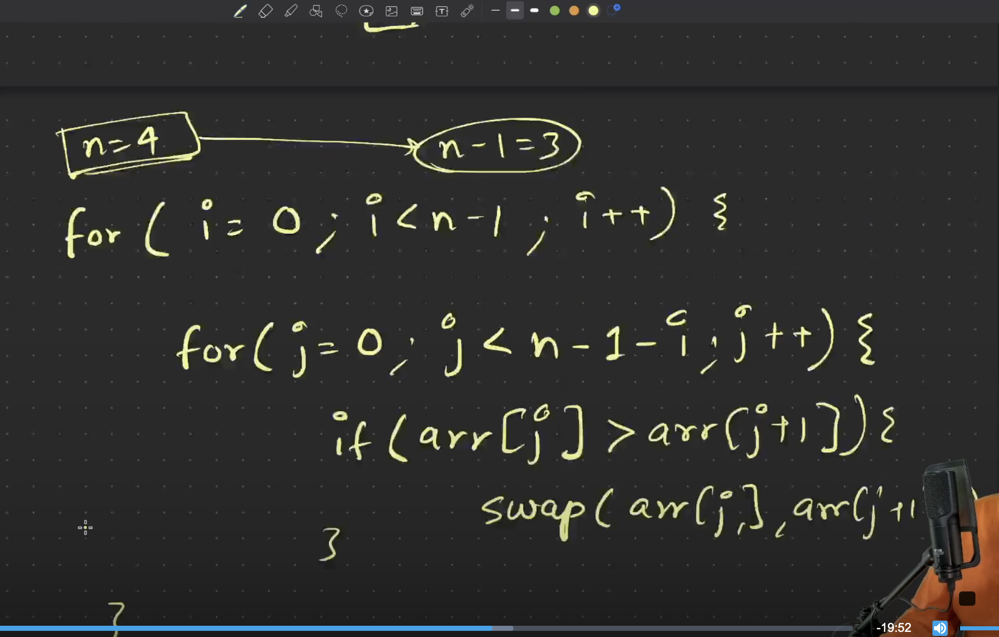
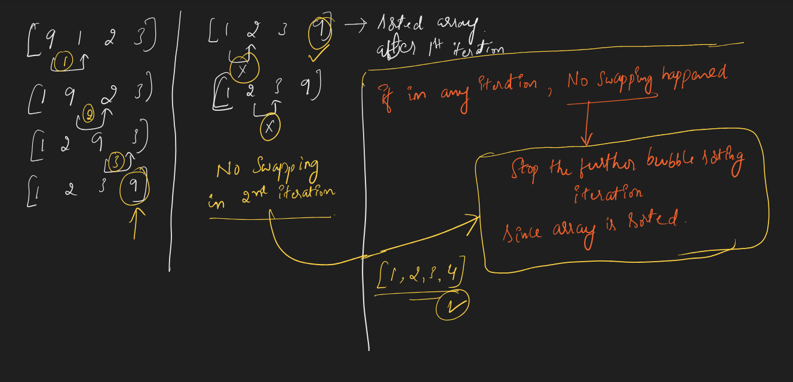
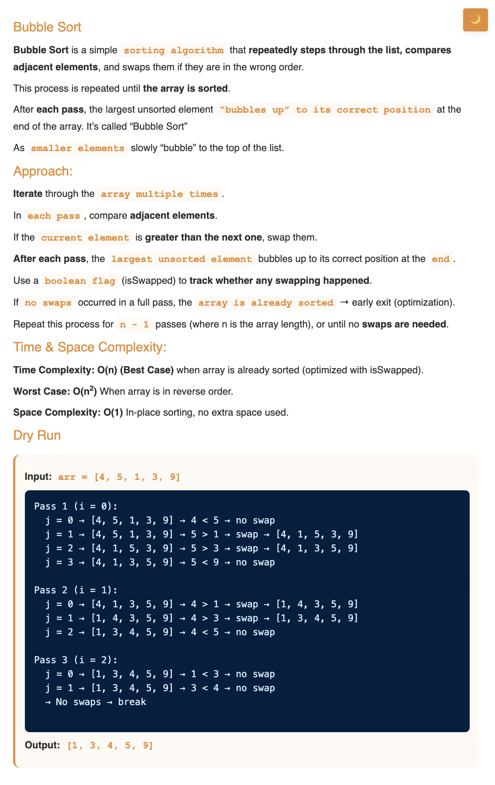
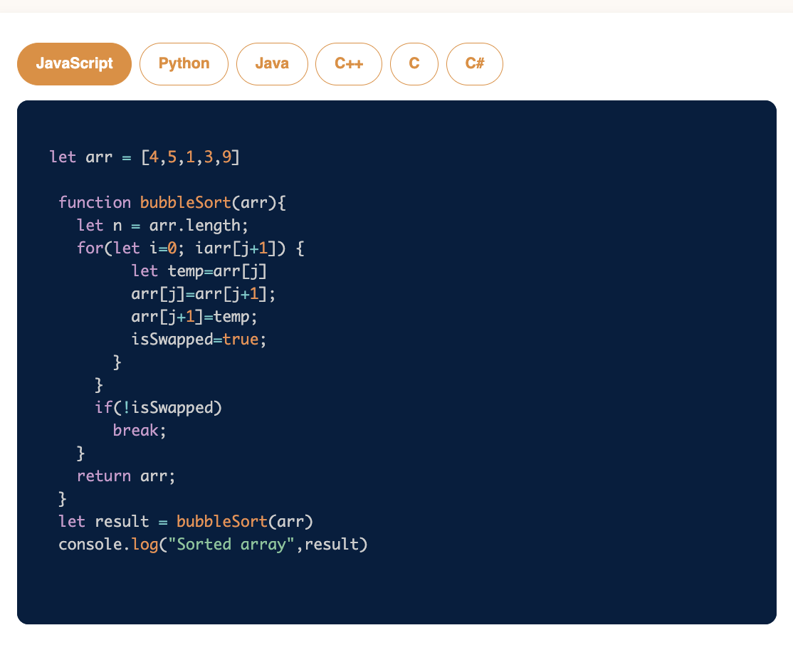

# Requirement or Problem statement & (Thought Process) Solution Approach

## 1. Problem statement

- Bubble Sort, sorting in ascending order
- Learn the bubble sort algorithm, where adjacent elements are compared and swapped to move larger elements to the end of the list.

## 2. Understand the problem with sample inputs & outputs

### Sample - 1

- Input: arr = [4, 5, 1, 3, 9]
- Output: [1, 3, 4, 5, 9]

### Sample - 2

- Input: arr = [10, 2, 5, 1, 3]
- Output: [1, 2, 3, 5, 10]

## 3. Approach & solution notes

<details>
  <summary><b>Approach - 1</b></summary>

- Thought Process / Approach

  - using 2 nested for loop
  - Outer iteration i, till n-1 times

    - on every iteration end, will Bubble up largest element & place at the end right position
    - Inner iteration j, compare current & next element
      - if current > next element, Swap()

  - 
  - 

- Make sure dry run with sample examples with notebooks

  - 
  - 

- Complexity

  - Time Complexity: O(n^2), where n is length of array

    - Can we improve better the time complexity ? Improvement scope in Bubble sort algo

      - 

      - What if array is already is sorted ?

  - Space Complexity: O(1)

</details>

<details>
  <summary><b>Solution Notes</b></summary>

- 
- 

</details>

## 3.1 Visual flow (spaced repetition)

**Interactive walkthrough — with Play / Prev / Next / presets / step duration:**

- <a href="https://pravn27.github.io/ds-algo-coding-challenge/namaste-dsa/easy/searching%20%26%20sorting/03/visual-flow.html" target="_blank" rel="noopener noreferrer">Open on GitHub Pages &#8599;</a> — live, public, works on any device
- <a href="./visual-flow.html" target="_blank" rel="noopener noreferrer">Open local file &#8599;</a> — for IDE / offline use

**Mnemonic:** Each pass **bubbles the largest unsorted element** to the right end. Compare adjacent `arr[j]` vs `arr[j+1]`: if out of order, swap. After pass `i`, the last `i + 1` elements are **locked**. If a full pass makes **0 swaps** — array is sorted — **break early**.

```text
[  unsorted region (j scans here)  |  sorted / locked (green)  ]
   j (orange) vs j+1 (blue)            already bubbled into place
```

```mermaid
flowchart TD
  S["i = 0, isSwapped = false"] --> OL{"i &lt; n - 1 ?"}
  OL -->|no| R["return arr (sorted)"]
  OL -->|yes| IL{"j &lt; n - 1 - i ?"}
  IL -->|no| PE["Pass i done: largest bubbled to index n-1-i"]
  IL -->|yes| C{"arr[j] &gt; arr[j+1] ?"}
  C -->|yes| SW["swap(arr[j], arr[j+1])<br>isSwapped = true"]
  C -->|no| NS["skip (already in order)"]
  SW --> INC["j = j + 1"]
  NS --> INC
  INC --> IL
  PE --> EE{"isSwapped === false ?"}
  EE -->|yes| R
  EE -->|no| NP["i = i + 1, isSwapped = false"]
  NP --> IL

  CX["Time: O(n&#178;) worst/avg &middot; O(n) best (early exit)<br>Space: O(1) &middot; Stable sort"]:::cx
  classDef cx fill:#1a2332,stroke:#7eb8ff,color:#7eb8ff
```



| Variable | Role |
|--------|------|
| `i` (outer loop) | Pass number — after pass `i`, element at `n - 1 - i` is locked in its final sorted position |
| `j` (inner loop) | Scans the unsorted region `[0 … n - 2 - i]`, comparing adjacent pairs |
| `isSwapped` | Tracks if any swap occurred during the current pass — enables **early exit optimization** |
| Sorted zone | After each pass, the rightmost cells turn green — they are locked and never compared again |

### Complexity

| | Big-O | Why |
|---|---|---|
| **Time (worst/avg)** | `O(n^2)` | nested loops: up to `n - 1` passes, each scanning up to `n - 1 - i` pairs |
| **Time (best)** | `O(n)` | already-sorted input — 1 pass, 0 swaps, **early exit** |
| **Space** | `O(1)` | in-place swaps, only a temp variable |

> Concrete intuition for spaced repetition:
> - `[5, 4, 3, 2, 1]` (worst) — **10 swaps**, 4 full passes, every pair out of order
> - `[1, 2, 3, 4, 5, 6, 6]` (best) — **0 swaps**, 1 pass, early exit immediately
> - The `isSwapped` optimization is what makes best-case `O(n)` possible

> Tip: open the interactive page, try the **early exit** preset first — seeing 0 swaps trigger the break is the clearest way to remember the optimization.

## 4. Implementation & Refactor

- [Coding solution in JS](./index.js)

## 5. (Good to ask) Edge / Corner case covered with refactor / improvements
