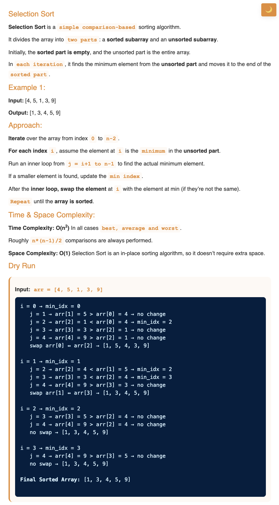
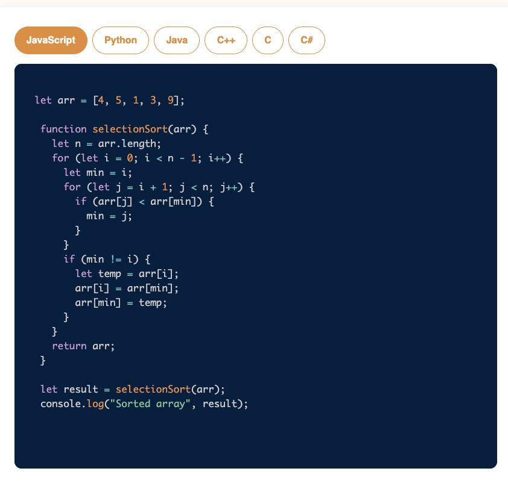

# Requirement or Problem statement & (Thought Process) Solution Approach

## 1. Problem statement

- Selection Sort, sorting in ascending order
- Learn the selection sort technique, where the smallest element is repeatedly moved to the front. Great for understanding sorting fundamentals.

## 2. Understand the problem with sample inputs & outputs

### Sample - 1

- Input: arr = [4, 5, 1, 3, 9]
- Output: [1, 3, 4, 5, 9]

### Sample - 2

- Input: arr = [10, 2, 5, 1, 3]
- Output: [1, 2, 3, 5, 10]

## 3. Approach & solution notes

  
<b>Approach - 1</b>

- Thought Process / Approach

  - using 2 for loop
  - Outer iteration i, till n-1 times

    - on every iteration end, will Bubble up largest element & place at the end right position
    - Inner iteration j, compare current & next element
      - if current > next element, Swap()

  - 
  - 

- Make sure dry run with sample examples with notebooks

  - 
  - 

- Complexity

  - Time Complexity: O(n^2), where n is length of array

    - Can we improve better the time complexity ? Improvement scope in Bubble sort algo

      - 

      - What if array is already is sorted ?

  - Space Complexity: O(1)

  
<b>Solution Notes</b>

- 
- 

## 4. Implementation & Refactor

- [Coding solution in JS](./index.js)

## 5. (Good to ask) Edge / Corner case covered with refactor / improvements
