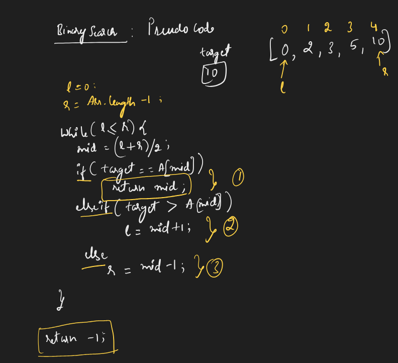
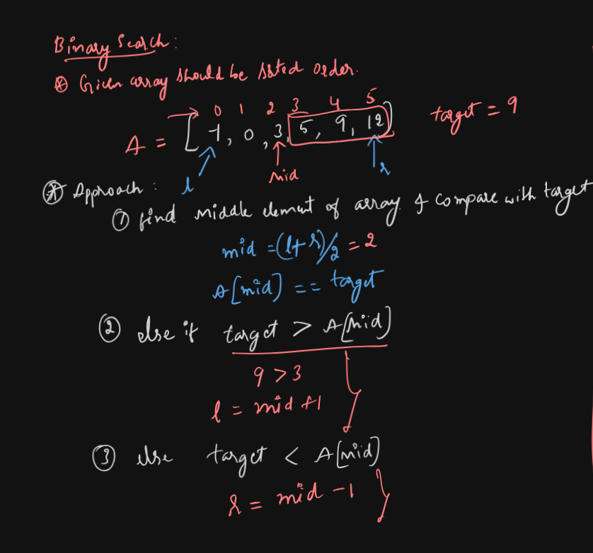
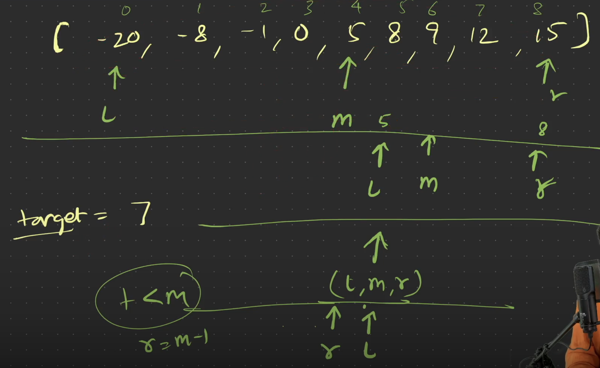
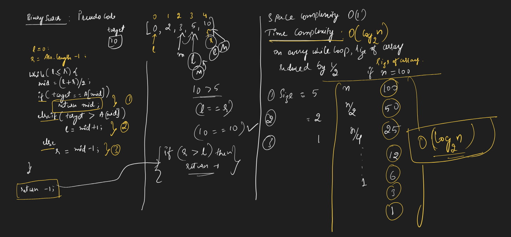
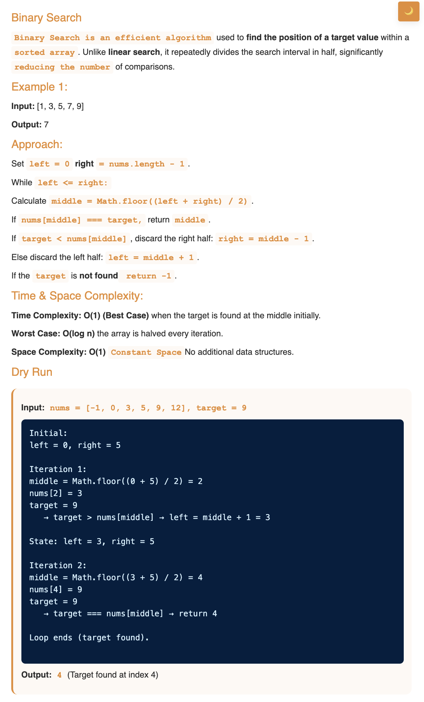
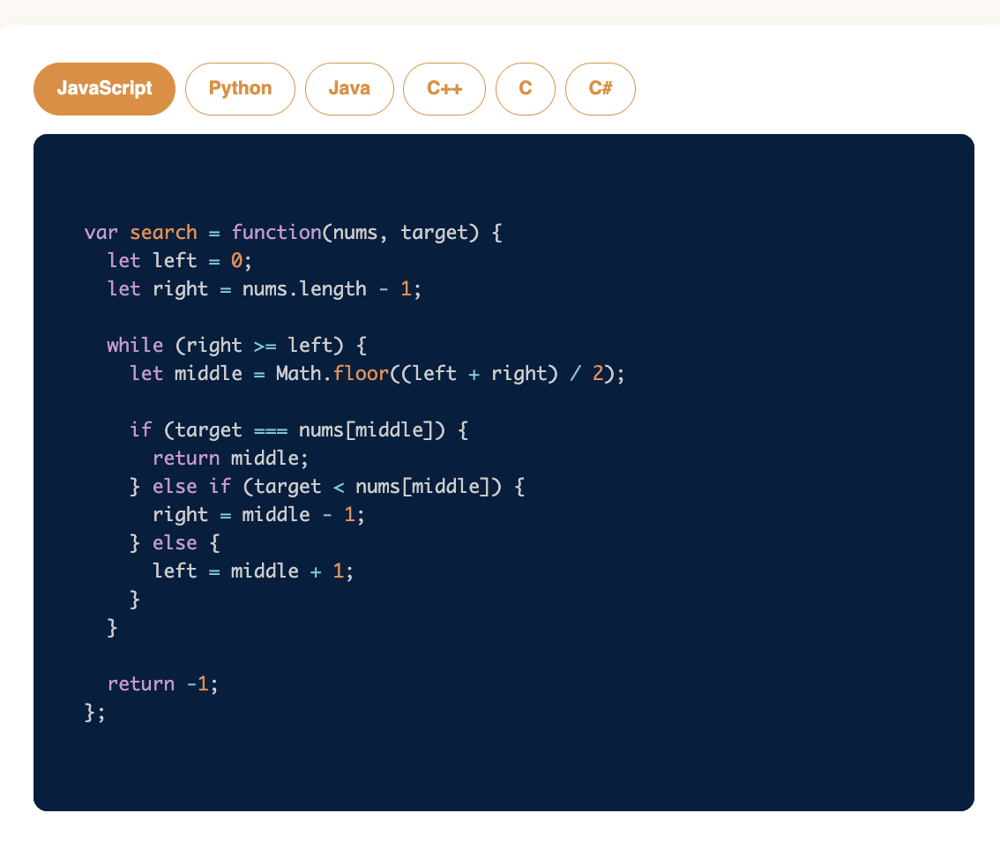

# Requirement or Problem statement & (Thought Process) Solution Approach

## 1. Problem statement

- Binary Search, search target element in an array, if found return index of that, else return -1
- Learn binary search, an efficient technique to find elements in a sorted array by dividing the search space in half.
- Binary Search criteria, its only applied to given array should be sorted increasing order
- https://leetcode.com/problems/binary-search/

## 2. Understand the problem with sample inputs & outputs

### Sample - 1

- Input: arr = [2, 3, 5, 10, 15], target = 15
- Output: 4

### Sample - 2

- Input: arr = [1, 2, 4, 8], target = 5
- Output: -1

## 3. Approach & solution notes

  
<b>Approach - 1</b>

- Thought Process / Approach

  - using While loop, while randomly moving in the array
  - finding mid element with left, right pointer
  - 3 possible, inside while loop (left <= right)

    - find the mid element & compare with target
      if found return mid index
    - else if target > A[mid] update left pointer as mid + 1
      - left = mid + 1
    - else update right pointer as mid - 1
      - right = mid - 1

  - if while loop condition fails (right pointer > left pointer) means target element not found, return -1

  - 
  - 
  - 

- Make sure dry run with sample examples with notebooks

  - 
  - 

- Complexity

  - Time Complexity: O(log n), where n is length of array, since Binary search, on every while loop, divides/split the array into half 1/2
  - Space Complexity: O(1)

  
<b>Solution Notes</b>

- 
- 

## 4. Implementation & Refactor

- [Coding solution in JS](./index.js)

## 5. (Good to ask) Edge / Corner case covered with refactor / improvements
