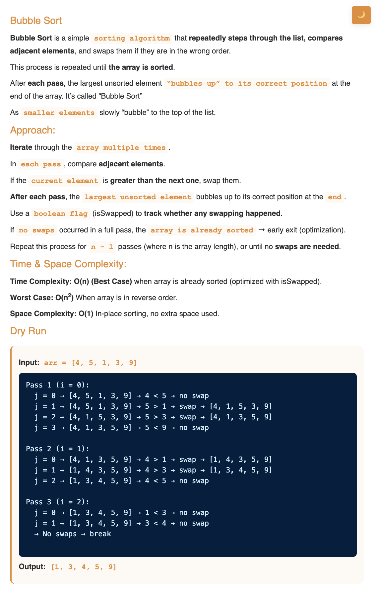

# Requirement or Problem statement & (Thought Process) Solution Approach

## 1. Problem statement

- Bubble Sort, sorting in ascending order
- Learn to traverse an array and check each element sequentially to find a match. Simple yet essential for unsorted arrays.

## 2. Understand the problem with sample inputs & outputs

### Sample - 1

- Input: arr = [4, 5, 1, 3, 9]
- Output: [1, 3, 4, 5, 9]

### Sample - 2

- Input: arr = [10, 2, 5, 1, 3]
- Output: [1, 2, 3, 5, 10]

## 3. Approach & solution notes

  
<b>Approach - 1</b>

- Thought Process / Approach

  - use for loop
  - traverse each element in array & compare with target, if found return index of that
    - if (arr[i] == target) return i
  - if target element not found, return -1

- Make sure dry run with sample examples with notebooks

- Complexity

  - Time Complexity: O(n), where n is length of array
  - Space Complexity: O(1)

  
<b>Solution Notes</b>

- 
- 

## 4. Implementation & Refactor

- [Coding solution in JS](./index.js)

## 5. (Good to ask) Edge / Corner case covered with refactor / improvements
