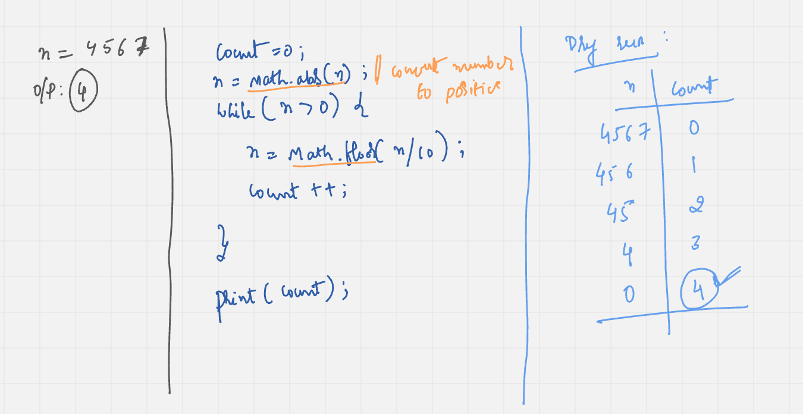
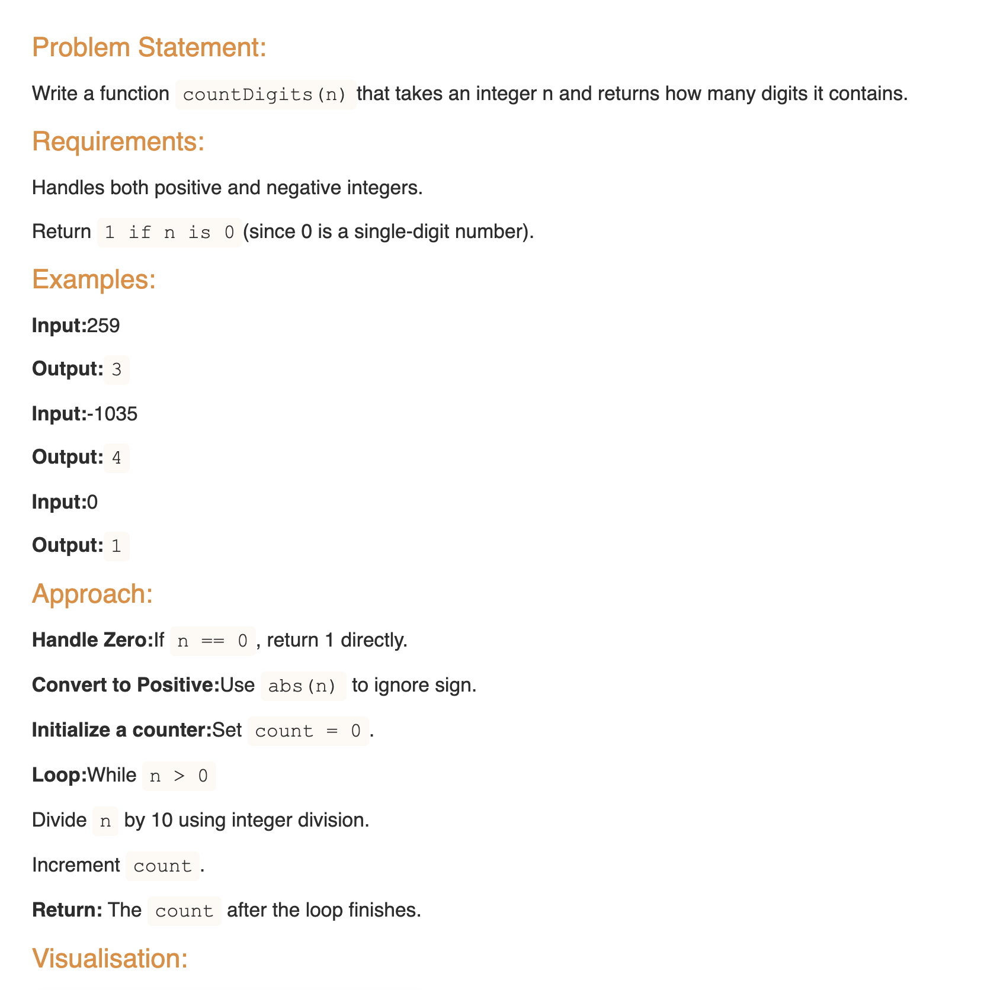
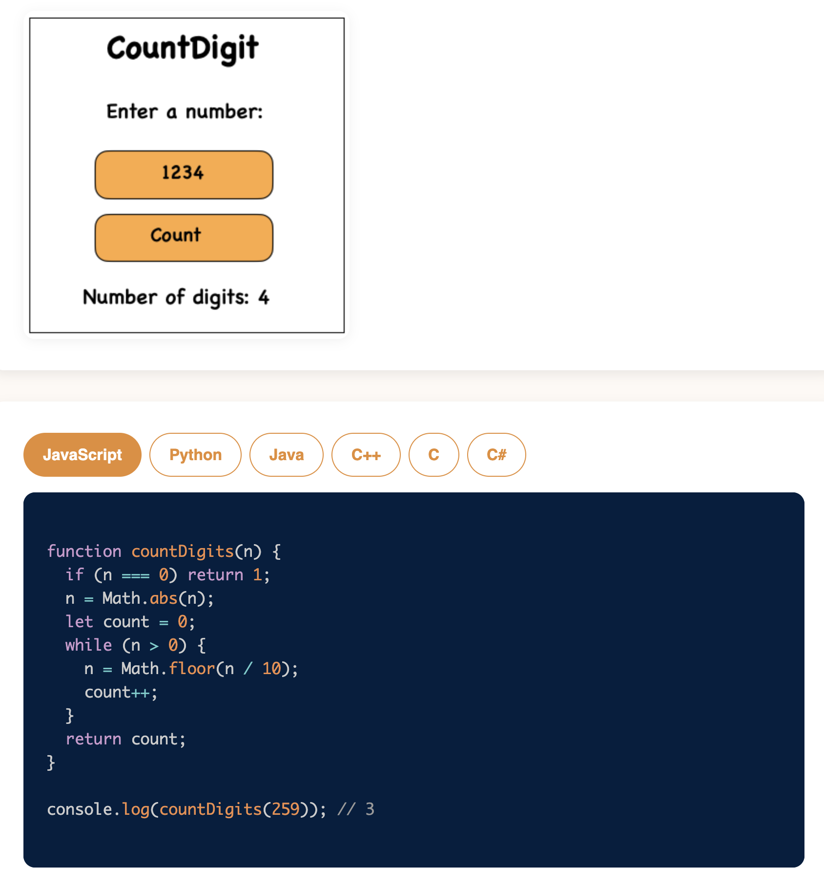

# Requirement or Problem statement & (Thought Process) Solution Approach

## 1. Problem statement

- Write a function countDigits(n) that takes an integer n and returns how many digits it contains.
- Reference
  - https://pravn27.github.io/ds-algo-tech-doc/docs/ds-algo-course-tutorials/namaste-dsa/readerDoc/warm-up/count-digit

## 2. Understand the problem with sample inputs & outputs

### Sample - 1

- Input: n = 256
- Output: 3

### Sample - 2

- Input: n = 34562
- Output: 5

### Sample - 3

- Input: n = -34
- Output: 2

## 3. Approach & solution notes

  
<b>Approach - 1</b>

- Thought Process / Approach

  - Divide number by 10
    - Why 10 ? All possible digits 0, 1, ..... 9 will occur, means 0 to 9 will get total count as 10
  - define count variable
  - use while loop, will run till getting less than or equal to 0
    - num = Math.floor(num / 10)
    - count++
  - after exiting loop, return / print count

- 

- Make sure dry run with sample examples with notebooks
- Use javascript Math methods

  - Check & explore - Math.floor(), Math.ceil(), Math.round(), Math.abs()

- Complexity

  - Time Complexity: O(length of number), which is O(1)
  - Space Complexity: O(1)

  
<b>Solution Notes</b>

- 
- 

## 4. Implementation & Refactor

- [Coding solution in JS](./index.js)

## 5. (Good to ask) Edge / Corner case covered with refactor / improvements

- What if, n is 0, should return 1
- What if, n is negative number, should return only digit count
