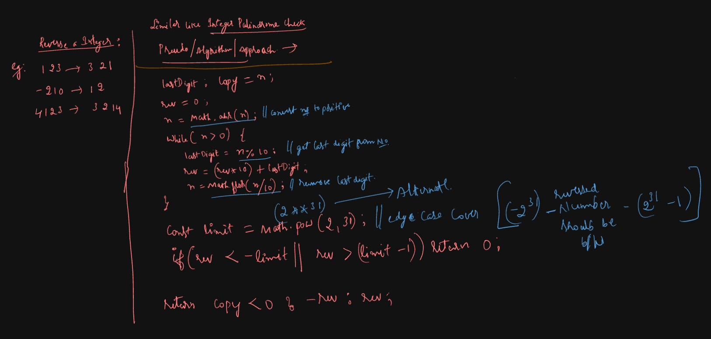
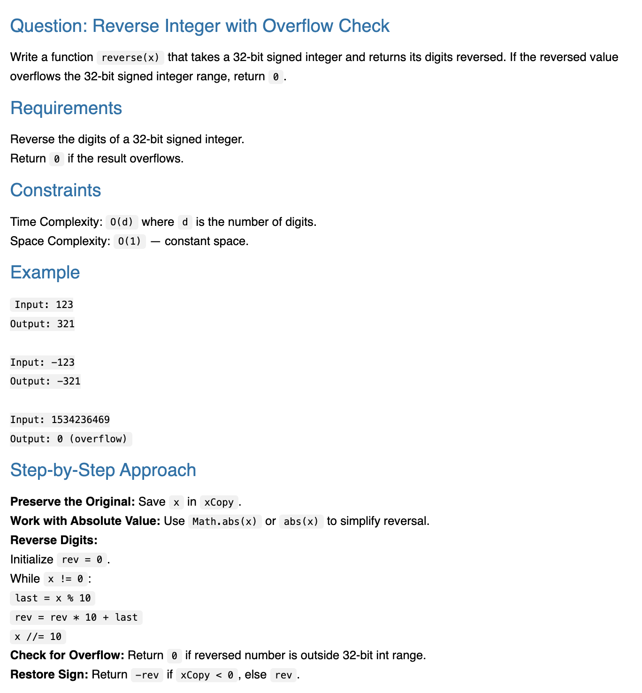
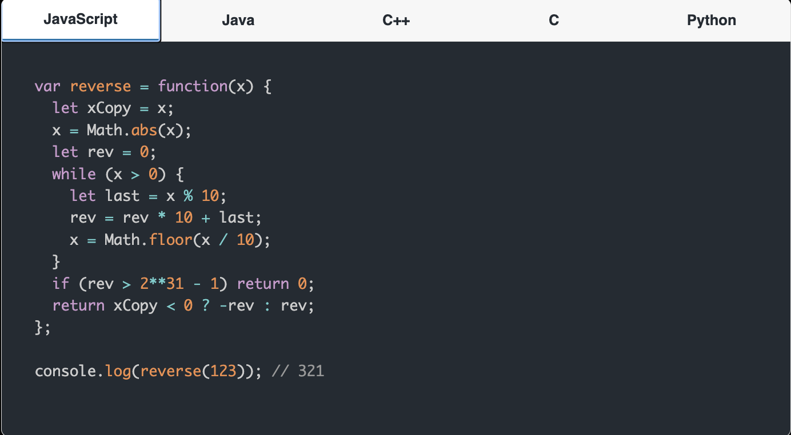

# Requirement or Problem statement & (Thought Process) Solution Approach

## 1. Problem statement

- Write a function reverseInteger(x) that takes a 32-bit signed integer and returns its digits reversed. If the reversed value overflows the 32-bit signed integer range, return 0.
- https://leetcode.com/problems/reverse-integer/description/

## 2. Understand the problem with sample inputs & outputs

### Sample - 1

- Input: 123
- Output: 321

### Sample - 2

- Input: -123
- Output: -321

### Sample - 3

- Input: 4563
- Output: 3654

### Sample - 4

- Input: -1230
- Output: -321

## 3. Approach & solution notes

  
<b>Approach - 1</b>

- Thought Process / Approach

  - run While until n < 0
    - get last digit of num, by % operator as n % 10
    - create reverse num
      - rev = (rev \* 10) + rem;
    - remove last digit of num
      - Math.floor(n/10)
  - return reversed number
  - use Math.pow() or 2 ** 31 to get value of 2 ** 31
  - why Divide, Remainder number by 10
    - Why 10 ? All possible digits 0, 1, ..... 9 will occur, means 0 to 9 will get total count as 10

- 

- Make sure dry run with sample examples with notebooks

- Complexity

  - Time Complexity: O(d), where d is number of digits
  - Space Complexity: O(1)

  
<b>Solution Notes</b>

- 
- 

## 4. Implementation & Refactor

- [Coding solution in JS](./index.js)

## 5. (Good to ask) Edge / Corner case covered with refactor / improvements
