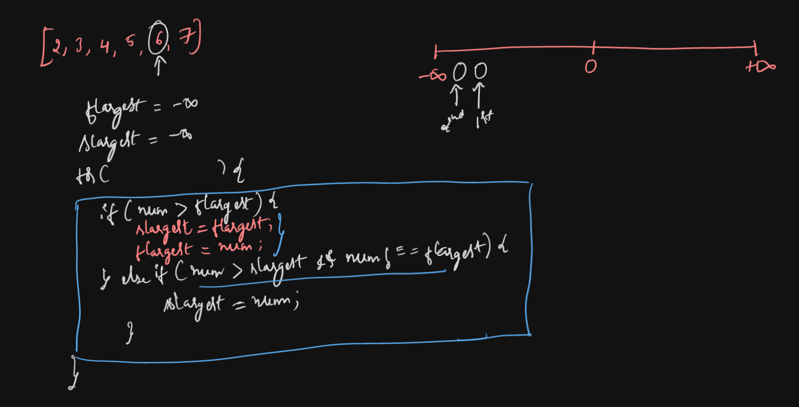

# Requirement or Problem statement & (Thought Process) Solution Approach

## 1. Problem statement

- Write a function secondSmallest(arr) that returns the Second Smallest distinct number in an array.

## 2. Features / Use cases

## 3. Understand the problem with sample inputs & outputs

### Sample - 1

- Input: [50, 30, -2, -40, -1, 100]
- Output: -2

### Sample - 2

- Input: [6, 10, 12, 20, 30, 30, 30]
- Output: 10

### Sample - 3

- Input: [-6, -10, -12, -20, -30]
- Output: -20

## 4. Approach & solution notes

  
<b>Approach - 1</b>

- Thought Process / Approach - one pass solution
  - Similar like finding First Smallest elements
    - Declare & assign First smallest & Second smallest variable to Infinity
  - Use for loop to iterate / traverse each array elements
    - Compare with first smallest
    - Prior to first smallest update, update Second smallest as first smallest
    - Compare with second smallest & should not be equal to first smallest(for distinct/unique number check)
  - return Second Smallest

<!-- -  -->

- Make sure dry run with sample examples with notebooks

- Complexity
  - Time Complexity: O(n)
  - Space Complexity: O(1)

## 5. Implementation & Refactor

- [Coding solution in JS](./index.js)

## 6. (Good to ask) Edge / Corner case covered with refactor / improvements

- What if, instead of array type if pass as other objects ?
  - Check whether its array or not, should return error message
- What if array is empty ?
  - Should return error message
- What if Array has less than 2 elements ?
  - Should return error message
- What if Array has negative numbers ?
- What if Array has Duplicates numbers ?
- What if Array has Infinity numbers ?
