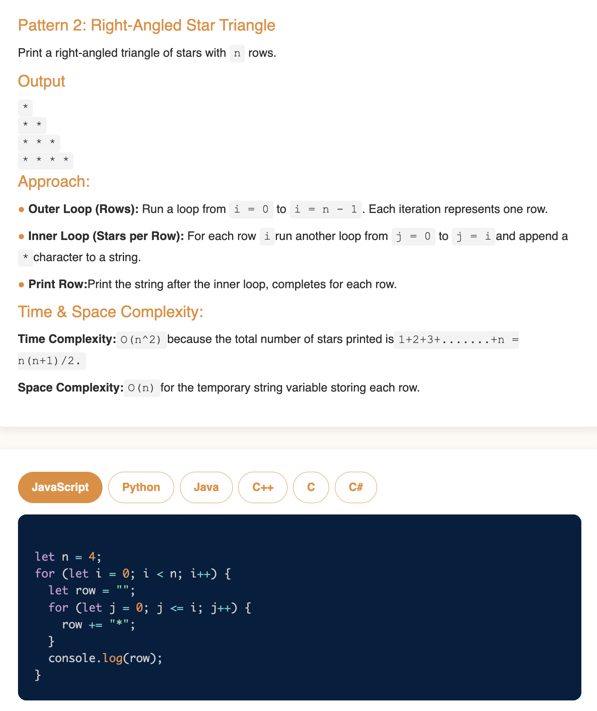

# Requirement or Problem statement & (Thought Process) Solution Approach

## 1. Problem statement

- Write a function to (Right angled star triangle) Print Star Pattern in 1, 2, 3....n star rows, take n as input parameter
- Reference
  - https://pravn27.github.io/ds-algo-tech-doc/docs/ds-algo-course-tutorials/namaste-dsa/readerDoc/warm-up/star-pattern#star-pattern---2

## 2. Understand the problem with sample inputs & outputs

### Sample - 1

- Input: n = 4
- Output:

      *
      * *
      * * *
      * * * *

### Sample - 2

- Input: n = 3
- Output:

      *
      * *
      * * *

## 3. Approach & solution notes

  
<b>Approach - 1</b>

- Thought Process / Approach - two pass / loops (i, j) solution

  - Think as 2D matrix with
    - i (how many rows required)
    - j (how many columns required)
  - 2 loops required - rows as i, columns as j
  - Outer loop, row as i
  - define starAppend variable to hold \*
    - starAppend = "";
  - Inner loop, column as j, will run till i+1 or j <= i
    - starAppend = starAppend + " \* ";
  - Print starAppend

- Make sure dry run with sample examples with notebooks

- Complexity

  - Time Complexity: O(n2), since its nested loops with 2 loops i, j
  - Space Complexity: O(1)

  
<b>Solution Notes</b>

- 

## 4. Implementation & Refactor

- [Coding solution in JS](./index.js)

## 5. (Good to ask) Edge / Corner case covered with refactor / improvements

- What if, n is <= 0
  - Should throw error, with proper message
