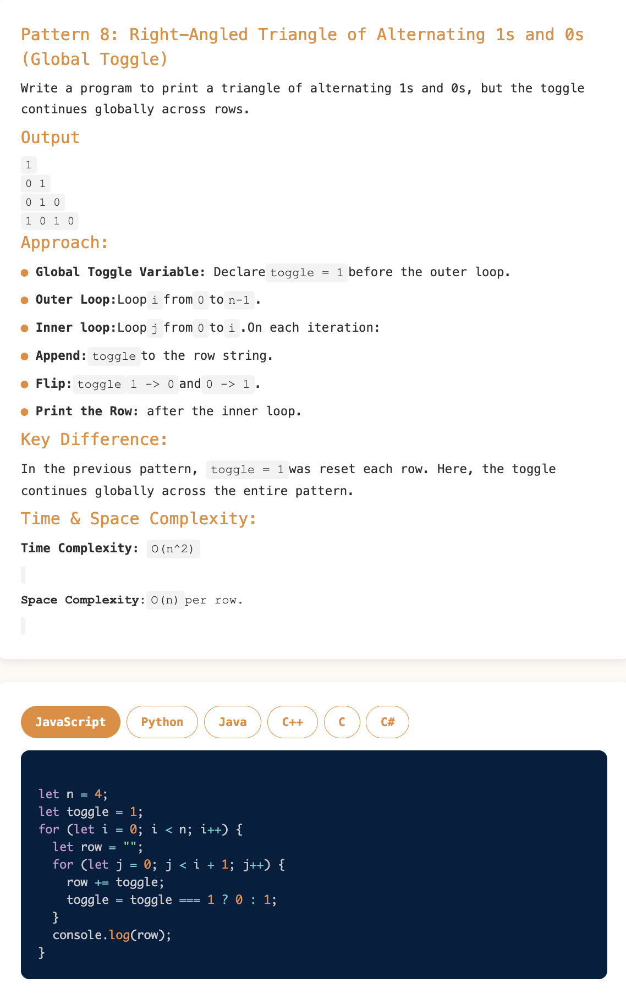

# Requirement or Problem statement & (Thought Process) Solution Approach

## 1. Problem statement

- Write a function to Print Right-Angled Triangle of Alternating 1s and 0s (Global Toggle), take n as input parameter
- Reference
  - https://pravn27.github.io/ds-algo-tech-doc/docs/ds-algo-course-tutorials/namaste-dsa/readerDoc/warm-up/star-pattern#star-pattern---8

## 2. Understand the problem with sample inputs & outputs

### Sample - 1

- Input: n = 4
- Output:

      1
      0 1
      0 1 0
      1 0 1 0

### Sample - 2

- Input: n = 3
- Output:

      1
      0 1
      0 1 0

## 3. Approach & solution notes

  
<b>Approach - 1</b>

- Thought Process / Approach

  - Think as 2D matrix with
    - i (how many rows required)
    - j (how many columns required)
  - define global variable toggle
    - toggle = "1"
  - 2 loops required - rows as i, columns as j
  - Outer loop, row as i, to loop till n
  - define append variable to hold alternative number 1, 0 ...etc
    - appendRow = "";
  - Inner loop will take as j, will run till (i+1) times
    - appendRow = appendRow + toggle;
    - check condition of toggle for "1" or "0" to change toggle
      - if toggle is 1
        - toggle = 0
      - if toggle is 0
        - toggle = 1
  - Print appendRow

- Make sure dry run with sample examples with notebooks

- Complexity

  - Time Complexity: O(n2), since its nested loops with 2 loops i, j
  - Space Complexity: O(1)

  
<b>Solution Notes</b>

- 

## 4. Implementation & Refactor

- [Coding solution in JS](./index.js)

## 5. (Good to ask) Edge / Corner case covered with refactor / improvements

- What if, n is <= 0
  - Should throw error, with proper message
